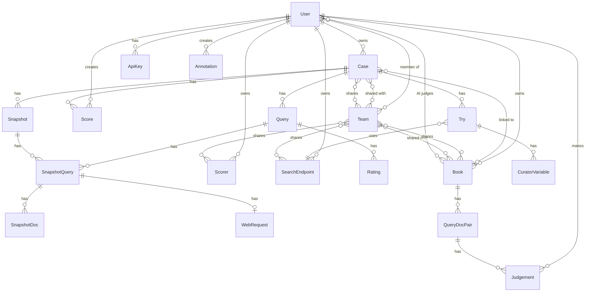

# Quepid Complete Application Specification

> **Role:** Rewrite-oriented reference for **schema columns**, **HTML Rails routes**, and **business rules** not spelled out elsewhere. Feature behavior, API catalog, frontend inventory, and migration strategy live in the docs linked below — not duplicated here.

**Last updated:** August 2026

---

## Table of Contents

1. [Documentation map](#1-documentation-map)
2. [Authentication and Authorization](#2-authentication-and-authorization) → see other docs
3. [Data Model](#3-data-model) — **canonical schema reference**
4. [Cases and Queries](#4-cases-and-queries-live-search-evaluation) → see other docs
5. [Search Endpoints](#5-search-endpoints) → see other docs
6. [Snapshots](#6-snapshots) → see other docs
7. [Books and Judgements](#7-books-and-judgements-offline-feedback) → see other docs
8. [AI Judge (Judge Judy)](#8-ai-judge-judge-judy) → see other docs
9. [Teams and Sharing](#9-teams-and-sharing) → see other docs
10. [Scorers](#10-scorers) → see other docs
11. [Import and Export](#11-import-and-export) → see other docs
12. [Analytics and Visualization](#12-analytics-and-visualization) → see other docs
13. [Admin](#13-admin) → see other docs
14. [Proxy and HTTP](#14-proxy-and-http) → see other docs
15. [Frontend (AngularJS SPA)](#15-frontend-angularjs-spa) → see other docs
16. [Frontend (Rails/Stimulus)](#16-frontend-railsstimulus) → see other docs
17. [Background Jobs](#17-background-jobs) → see other docs
18. [Real-Time (Turbo Streams)](#18-real-time-turbo-streams) → see other docs
19. [Configuration and Environment](#19-configuration-and-environment) → see other docs
20. [API Reference](#20-api-reference) — REST pointers + **canonical HTML routes**
21. [Edge Cases and Business Rules](#edge-cases-and-business-rules) — **canonical**

---

## 1. Documentation map

Quepid is a **search relevance evaluation platform** (cases, queries, ratings, books, judgements, teams). For product overview and tech stack see [`todo/QUEPID_FEATURES.md` §1](./todo/QUEPID_FEATURES.md#1-application-overview).

| Topic | Canonical doc |
|-------|----------------|
| How the code is organized | [`app_structure.md`](./app_structure.md) |
| Domain narrative (entities, workflows) | [`data_mapping.md`](./data_mapping.md), [`erd.png`](./erd.png) |
| Whole-app feature inventory | [`todo/QUEPID_FEATURES.md`](./todo/QUEPID_FEATURES.md) |
| Case workspace (`/case/...`) | [`todo/QUEPID_COREUI_FEATURES.md`](./todo/QUEPID_COREUI_FEATURES.md) |
| Core UI implementation quirks | [`todo/core_ui_implementation_reference.md`](./todo/core_ui_implementation_reference.md) |
| AngularJS removal / migration | [`todo/angularjs_removal_inventory.md`](./todo/angularjs_removal_inventory.md) |
| Angular event bus | [`todo/event_bus_inventory.md`](./todo/event_bus_inventory.md) |
| Open bugs and hardening | [`todo/todo.md`](./todo/todo.md) |
| Encryption | [`ENCRYPTION_SETUP.md`](./ENCRYPTION_SETUP.md) |
| Deployment and ops | [`operating_documentation.md`](./operating_documentation.md) |
| Solr / OpenSearch endpoint notes | [`endpoints_solr.md`](./endpoints_solr.md), [`endpoints_opensearch.md`](./endpoints_opensearch.md) |
| **Per-table schema (columns, associations)** | **this doc §3** |
| **HTML Rails routes (non-API)** | **this doc §20.5** |
| **Edge-case business rules** | **this doc [Edge Cases](#edge-cases-and-business-rules)** |
| REST API catalog | OpenAPI at `/api/docs`; conventions in [`DEVELOPER_GUIDE.md` § Stimulus HTTP](../DEVELOPER_GUIDE.md#stimulus-http-conventions) |
| Architectural decisions (narrative) | [`todo/QUEPID_FEATURES.md` §35](./todo/QUEPID_FEATURES.md#35-key-architectural-decisions) |

---

## 2. Authentication and Authorization

See [`todo/QUEPID_FEATURES.md` §4](./todo/QUEPID_FEATURES.md#4-authentication--authorization) and [§21 User Profile](./todo/QUEPID_FEATURES.md#21-user-profile--account-management). Devise/HTML session routes are summarized under [§20](#20-api-reference) below.

---

## 3. Data Model

**Domain narrative:** [`data_mapping.md`](./data_mapping.md) and [`erd.png`](./erd.png). Per-table column detail below is the **schema reference for rewrites** — do not duplicate in [`todo/QUEPID_FEATURES.md`](./todo/QUEPID_FEATURES.md) or other docs.

### 3.1 Entity Relationship Diagram

### 3.2 Core Models

#### Case ([app/models/case.rb](app/models/case.rb))

| Column | Type | Description |
|--------|------|-------------|
| id | integer | PK |
| case_name | string(191) | Display name |
| owner_id | integer | FK to users |
| scorer_id | integer | FK to scorers |
| book_id | integer | Optional FK to books (for import) |
| last_try_number | integer | Latest try number |
| archived | boolean | Soft delete |
| nightly | boolean | Run evaluation nightly |
| public | boolean | Public visibility |
| options | json | Additional options |
| created_at, updated_at | datetime | |

**Associations:** teams (HABTM), scorer, owner, tries, metadata, queries, ratings (through queries), scores, snapshots, annotations (through scores), book

**Scopes:** `not_archived`, `public_cases`, `nightly_run`, `with_counts`

**Key methods:** `really_destroy` (force delete with dependencies), `clone_case`, `mark_archived`/`mark_public`/`mark_private`, `rearrange_queries`, `public_id` (message verifier for sharing)

#### Query ([app/models/query.rb](app/models/query.rb))

| Column | Type | Description |
|--------|------|-------------|
| id | integer | PK |
| case_id | integer | FK to cases |
| query_text | string(2048) | Search term |
| information_need | string | Optional context |
| notes | text | Curator notes |
| options | json | Query-specific options (e.g., custom scorer) |
| arranged_at, arranged_next | bigint | For drag-drop ordering |
| created_at, updated_at | datetime | |

**Associations:** case, ratings, snapshot_queries

**Includes:** `Arrangement::Item` ([app/models/concerns/arrangement/item.rb](app/models/concerns/arrangement/item.rb)) - `parent_list`, `list_owner`, `insert_at`, `move_to`, `remove_from_list` for drag-drop ordering. `Arrangement::List` sequences queries.

#### Rating ([app/models/rating.rb](app/models/rating.rb))

| Column | Type | Description |
|--------|------|-------------|
| id | integer | PK |
| query_id | integer | FK to queries |
| doc_id | string(500) | Document ID from search results |
| rating | float | Relevance score (from scorer scale) |
| user_id | integer | Optional - who rated |
| created_at, updated_at | datetime | |

**Associations:** query, user (optional)

**Scope:** `fully_rated` - ratings with non-nil values

#### Try ([app/models/try.rb](app/models/try.rb))

| Column | Type | Description |
|--------|------|-------------|
| id | integer | PK |
| case_id | integer | FK to cases |
| try_number | integer | Sequential number |
| search_endpoint_id | bigint | FK to search_endpoints |
| name | string(50) | Display name |
| query_params | string(20000) | Search params (JSON or query string) |
| field_spec | string(500) | Field list for results |
| number_of_rows | integer | Default 10 |
| escape_query | boolean | Default true |
| ancestry | string(3072) | For try branching (has_ancestry) |
| created_at, updated_at | datetime | |

**Associations:** case, search_endpoint, curator_variables, snapshots

#### SearchEndpoint ([app/models/search_endpoint.rb](app/models/search_endpoint.rb))

| Column | Type | Description |
|--------|------|-------------|
| id | bigint | PK |
| owner_id | integer | FK to users |
| name | string | Display name |
| search_engine | string(50) | solr, es, os, searchapi, static, vectara, algolia |
| endpoint_url | string(500) | Base URL |
| api_method | string | GET, POST, PUT, JSONP |
| basic_auth_credential | string | Base64 user:pass |
| custom_headers | string(6000) | JSON |
| mapper_code | text | For SearchAPI - JavaScript mappers |
| test_query | text | Test query for mapper wizard |
| proxy_requests | boolean | Proxy through Quepid (CORS) |
| requests_per_minute | integer | Rate limit (0 = none) |
| options | json | Engine-specific options |
| archived | boolean | Soft delete |
| created_at, updated_at | datetime | |

**Associations:** owner, tries, teams (HABTM)

#### Scorer ([app/models/scorer.rb](app/models/scorer.rb))

| Column | Type | Description |
|--------|------|-------------|
| id | integer | PK |
| owner_id | integer | FK to users (null for communal) |
| name | string | Display name |
| code | text | JavaScript scoring logic |
| scale | string | Serialized array (e.g., "0,1,2,3") |
| scale_with_labels | text | JSON labels |
| show_scale_labels | boolean | Show labels in UI |
| communal | boolean | Shared by all users |
| created_at, updated_at | datetime | |

**Associations:** owner, snapshots, scores, teams (HABTM)

### 3.3 Snapshot Models

#### Snapshot ([app/models/snapshot.rb](app/models/snapshot.rb))

| Column | Type | Description |
|--------|------|-------------|
| id | integer | PK |
| case_id | integer | FK to cases |
| try_id | bigint | FK to tries |
| scorer_id | bigint | FK to scorers |
| name | string(250) | Display name |
| created_at, updated_at | datetime | |

**Associations:** case, try, scorer, snapshot_queries, snapshot_docs (through snapshot_queries), snapshot_file (ActiveStorage attachment)

#### SnapshotQuery ([app/models/snapshot_query.rb](app/models/snapshot_query.rb))

| Column | Type | Description |
|--------|------|-------------|
| id | integer | PK |
| snapshot_id | integer | FK to snapshots |
| query_id | integer | FK to queries |
| score | float | Query score |
| number_of_results | integer | Result count |
| response_status | integer | HTTP status |
| all_rated | boolean | All docs rated |
| created_at, updated_at | datetime | |

**Associations:** snapshot, query, snapshot_docs, web_request

#### SnapshotDoc ([app/models/snapshot_doc.rb](app/models/snapshot_doc.rb))

| Column | Type | Description |
|--------|------|-------------|
| id | integer | PK |
| snapshot_query_id | integer | FK to snapshot_queries |
| doc_id | string(500) | Document ID |
| position | integer | Rank in results |
| fields | mediumtext | Document fields (JSON) |
| explain | mediumtext | Explain (Solr) |
| rated_only | boolean | Filter to rated only |
| created_at, updated_at | datetime | |

#### WebRequest ([app/models/web_request.rb](app/models/web_request.rb))

Stores raw request/response for snapshot queries (debugging).

### 3.4 Book Models

#### Book ([app/models/book.rb](app/models/book.rb))

| Column | Type | Description |
|--------|------|-------------|
| id | bigint | PK |
| owner_id | integer | FK to users |
| name | string | Display name |
| scale | string | Serialized (e.g., "0,1,2,3") |
| scale_with_labels | text | JSON |
| scoring_guidelines | text | Markdown guidelines |
| show_rank | boolean | Show rank in judging |
| support_implicit_judgements | boolean | |
| archived | boolean | Soft delete |
| populate_job | string | Job ID when populating |
| import_job | string | Job ID when importing |
| export_job | string | Job ID when exporting |
| created_at, updated_at | datetime | |

**Associations:** owner, teams (HABTM), ai_judges (HABTM via books_ai_judges), query_doc_pairs, judgements (through query_doc_pairs), judges (through judgements), cases, metadata, import_file, export_file (ActiveStorage)

**Validation:** `scale_cannot_be_changed_if_judgements_exist`

#### QueryDocPair ([app/models/query_doc_pair.rb](app/models/query_doc_pair.rb))

| Column | Type | Description |
|--------|------|-------------|
| id | bigint | PK |
| book_id | bigint | FK to books |
| query_text | string(2048) | Search term |
| doc_id | string(500) | Document ID |
| position | integer | Rank in results |
| document_fields | mediumtext | JSON - doc content for AI judge |
| information_need | string | |
| notes | text | |
| options | json | |
| created_at, updated_at | datetime | |

**Associations:** book, judgements

#### Judgement ([app/models/judgement.rb](app/models/judgement.rb))

| Column | Type | Description |
|--------|------|-------------|
| id | bigint | PK |
| query_doc_pair_id | bigint | FK to query_doc_pairs |
| user_id | integer | FK to users (null for anonymous) |
| rating | float | Relevance score |
| unrateable | boolean | Cannot be rated |
| judge_later | boolean | Defer judgement |
| explanation | text | AI judge explanation |
| created_at, updated_at | datetime | |

**Associations:** query_doc_pair, user

**Validation:** Unique (user_id, query_doc_pair_id) when user_id present; rating required unless unrateable or judge_later

**Special states:** `mark_unrateable!` (rating=nil, unrateable=true), `mark_judge_later!` (rating=nil, judge_later=true)

**Scope:** `rateable` - where unrateable=false and judge_later=false

### 3.5 User and Team Models

#### User ([app/models/user.rb](app/models/user.rb))

| Column | Type | Description |
|--------|------|-------------|
| id | integer | PK |
| email | string(80) | Unique |
| name | string | |
| password | string(120) | BCrypt hashed |
| administrator | boolean | Admin access |
| locked | boolean | Account locked |
| locked_at | datetime | |
| default_scorer_id | integer | FK to scorers |
| llm_key | string(4000) | Encrypted - for AI judges |
| system_prompt | string(4000) | AI judge prompt |
| options | json | judge_options, etc. |
| completed_case_wizard | boolean | Skip new user wizard |
| invitation_* | various | Devise Invitable |
| created_at, updated_at | datetime | |

**Encrypted:** `llm_key` (Rails encrypts, deterministic: false)

**Concerns:** `Profile` - avatar_url (Gravatar), display_name

**Other:** agreed/agreed_time (T&C), company, email_marketing, profile_pic, num_logins; scope :only_ai_judges; judge_options (from options['judge_options']); unseen_app_notifications

#### Team ([app/models/team.rb](app/models/team.rb))

| Column | Type | Description |
|--------|------|-------------|
| id | integer | PK |
| name | string | Unique |
| created_at, updated_at | datetime | |

**Associations:** cases, members (User), scorers, search_endpoints, books (all HABTM)

### 3.6 ForUserScope Concern

**Models:** Case, Book, Scorer, SearchEndpoint

**Logic:** `for_user(user)` scope returns records where user is owner OR user is member of a team that has the resource shared. Uses `left_joins(teams: :members).where(teams_members: { member_id: user.id })` for team access.

### 3.7 Supporting Models

| Model | Purpose |
|-------|---------|
| CaseMetadatum | user_id, case_id, last_viewed_at |
| BookMetadatum | user_id, book_id, last_viewed_at |
| Annotation | user_id, message, source - linked to Score |
| Announcement | author_id, text, live - site announcements |
| AnnouncementViewed | user_id, announcement_id |
| CuratorVariable | try_id, name, value |
| MapperWizardState | user_id, search_url, html_content, docs_mapper, numberOfResultsMapper, etc. |
| ApiKey | user_id, token_digest |

### 3.8 Score Model

#### Score ([app/models/score.rb](app/models/score.rb))

| Column | Type | Description |
|--------|------|-------------|
| id | integer | PK |
| case_id | integer | FK to cases |
| try_id | integer | FK to tries |
| user_id | integer | Who ran evaluation |
| scorer_id | bigint | FK to scorers |
| annotation_id | integer | Optional FK to annotations |
| score | float | Case score |
| all_rated | boolean | All queries fully rated |
| queries | mediumblob | Serialized query scores (JSON) |
| created_at, updated_at | datetime | |

**Associations:** case, try, user, scorer, annotation

**Table name:** `case_scores`

**Scopes:** `last_one` (most recent), `scored` (with score), `sampled(case_id, count)` (for analytics)

---
## 4. Cases and Queries (Live Search Evaluation)

See [`todo/QUEPID_FEATURES.md` §5–7, §10](./todo/QUEPID_FEATURES.md#5-case-management), [`todo/QUEPID_COREUI_FEATURES.md`](./todo/QUEPID_COREUI_FEATURES.md), and [`todo/core_ui_implementation_reference.md`](./todo/core_ui_implementation_reference.md).

---

## 5. Search Endpoints

See [`todo/QUEPID_FEATURES.md` §9](./todo/QUEPID_FEATURES.md#9-search-endpoint-integration), [`endpoints_solr.md`](./endpoints_solr.md), [`endpoints_opensearch.md`](./endpoints_opensearch.md).

---

## 6. Snapshots

See [`todo/QUEPID_FEATURES.md` §11](./todo/QUEPID_FEATURES.md#11-snapshot--diff-system) and [`todo/QUEPID_COREUI_FEATURES.md`](./todo/QUEPID_COREUI_FEATURES.md).

---

## 7. Books and Judgements (Offline Feedback)

See [`todo/QUEPID_FEATURES.md` §8](./todo/QUEPID_FEATURES.md#8-book-judgment-collection-system) and [§19 Bulk Judging](./todo/QUEPID_FEATURES.md#19-bulk-judging-interface).

---

## 8. AI Judge (Judge Judy)

See [`todo/QUEPID_FEATURES.md` §14](./todo/QUEPID_FEATURES.md#14-ai-judge-integration).

---

## 9. Teams and Sharing

See [`todo/QUEPID_FEATURES.md` §12](./todo/QUEPID_FEATURES.md#12-team-collaboration).

---

## 10. Scorers

See [`todo/QUEPID_FEATURES.md` §7](./todo/QUEPID_FEATURES.md#7-rating--scoring-system) and [`admin_scorer_editing.md`](./admin_scorer_editing.md).

---

## 11. Import and Export

See [`todo/QUEPID_FEATURES.md` §13](./todo/QUEPID_FEATURES.md#13-importexport).

---

## 12. Analytics and Visualization

See [`todo/QUEPID_FEATURES.md` §17](./todo/QUEPID_FEATURES.md#17-analytics--tracking), [§30 Analytics Visualizations](./todo/QUEPID_FEATURES.md#30-analytics-visualizations), and [§33 Frog Report](./todo/QUEPID_FEATURES.md#33-frog-report-rating-analysis-dashboard).

---

## 13. Admin

See [`todo/QUEPID_FEATURES.md` §16](./todo/QUEPID_FEATURES.md#16-admin-dashboard), [`admin_scorer_editing.md`](./admin_scorer_editing.md), and [`admin_communal_scorers_removal.md`](./admin_communal_scorers_removal.md).

---

## 14. Proxy and HTTP

See [`todo/QUEPID_FEATURES.md` §20](./todo/QUEPID_FEATURES.md#20-proxy--http-layer).

---

## 15. Frontend (AngularJS SPA)

See [`todo/angularjs_removal_inventory.md`](./todo/angularjs_removal_inventory.md), [`todo/QUEPID_COREUI_FEATURES.md`](./todo/QUEPID_COREUI_FEATURES.md), [`todo/event_bus_inventory.md`](./todo/event_bus_inventory.md), and [`todo/core_ui_implementation_reference.md`](./todo/core_ui_implementation_reference.md).

---

## 16. Frontend (Rails/Stimulus)

See [`todo/QUEPID_FEATURES.md` §18](./todo/QUEPID_FEATURES.md#18-frontend-architecture), [§15 Mapper Wizard](./todo/QUEPID_FEATURES.md#15-mapper-wizard), and [§19 Bulk Judging](./todo/QUEPID_FEATURES.md#19-bulk-judging-interface).

---

## 17. Background Jobs

See [`todo/QUEPID_FEATURES.md` §22](./todo/QUEPID_FEATURES.md#22-background-job-processing).

---

## 18. Real-Time (Turbo Streams)

See [`todo/QUEPID_FEATURES.md` §24](./todo/QUEPID_FEATURES.md#24-real-time-features).

---

## 19. Configuration and Environment

See [`todo/QUEPID_FEATURES.md` §25](./todo/QUEPID_FEATURES.md#25-configuration--feature-flags), [§26 Infrastructure](./todo/QUEPID_FEATURES.md#26-infrastructure--deployment), and [`operating_documentation.md`](./operating_documentation.md).

---

## 20. API Reference

### 20.1 REST (JSON)

- **Auth:** session cookie (browser) or `Authorization: ApiKey <token>` / `?api_key=<token>`
- **Base path:** `/api` (V1 via `ApiConstraint`)
- **Canonical endpoint list:** OpenAPI at `/api/docs` (`oas_rails`); route source `config/routes.rb` (`namespace :api`)
- **Client conventions:** [`DEVELOPER_GUIDE.md` § Stimulus HTTP](../DEVELOPER_GUIDE.md#stimulus-http-conventions)
- **Legacy Angular HTTP:** [`todo/angularjs_removal_inventory.md` § Angular core HTTP](./todo/angularjs_removal_inventory.md#angular-core-http-patterns-legacy)
- **API surface overview:** [`todo/QUEPID_FEATURES.md` §23](./todo/QUEPID_FEATURES.md#23-api-surface)

### 20.5 HTML Rails Routes (Non-API)

### 20.5 HTML Rails Routes (Non-API)

| Method | Path | Controller | Purpose |
|--------|------|------------|---------|
| GET/POST/PATCH/DELETE | /cases/:case_id/book | books#* | Case-book linking (singular resource; linking also via API PATCH cases with book_id) |
| GET | /cases/:case_id/ratings | ratings#index | Ratings list (q param for search) |
| GET | /cases/:case_id/scores | scores#index | Scores list |
| DELETE | /cases/:case_id/scores/destroy_multiple | scores#destroy_multiple | Bulk delete scores |
| GET | /dropdown/cases | dropdown#cases | Cases for dropdown (HTML) |
| GET | /dropdown/books | dropdown#books | Books for dropdown (HTML) |
| GET/POST/PATCH/DELETE | /books/:book_id/query_doc_pairs | query_doc_pairs#* | QueryDocPair CRUD (HTML) |
| GET | /books/import | books/import#new | Import form |
| POST | /books/import | books/import#create | Start import |
| GET | /books/import/:id/edit | books/import#edit | Edit import in progress |
| PATCH | /books/export/:book_id | books/export#update | Trigger export |

### 20.6 Devise and account HTML routes

See [`todo/QUEPID_FEATURES.md` §4](./todo/QUEPID_FEATURES.md#4-authentication--authorization) and [§21](./todo/QUEPID_FEATURES.md#21-user-profile--account-management).

---

## Edge Cases and Business Rules

1. **Scale cannot change:** Book scale cannot be changed if judgements exist (scale_cannot_be_changed_if_judgements_exist)
2. **Optimistic-pessimistic rating (RatingsManager.calculate_rating_from_judgements):** 1-2 judgements → average; 3+ → take top 3, if all agree use that value, else use minimum (pessimistic)
3. **Proxy + JSONP:** api_method cannot be JSONP when proxy_requests is true
4. **User deletion:** Cannot delete user with judgements (must reassign); cannot delete if owned scorers are shared with teams
5. **HTTPS/HTTP:** Quepid runs HTTPS where possible; main page may be HTTP if Solr is HTTP (CORS)
6. **Relative URLs:** Use caseTryNavSvc.getQuepidRootUrl() not '/'
7. **Boolean params:** Use deserialize_bool_param for controller params
8. **Predicates:** credentials? not has_credentials?

More architectural narrative: [`todo/QUEPID_FEATURES.md` §35](./todo/QUEPID_FEATURES.md#35-key-architectural-decisions). Validators, helpers, services, and controller concerns: search `app/models/validators`, `app/helpers`, `app/services`, `app/controllers/concerns`, or [`app_structure.md`](./app_structure.md).

---

*End of specification*
