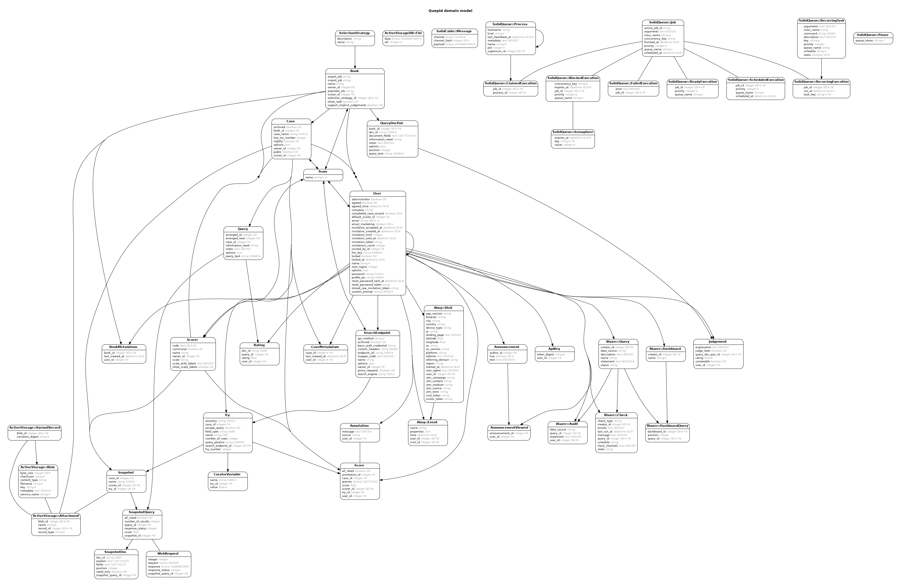

# Data Mapping

## Users/Teams

The `User` model is a typical model used for authenticating and authorizing a user in the app.

Everything starts with a user. The user owns entities they create, so **if a user is removed all associated objects are removed as well.**

In order to share stuff (eg. cases, scorers, etc) with other users, a user can create a `Team` and add any existing user to the team. Anything shared with a team is then shared with any members of the team.

The user that creates a `Team` is both the owner of the team and a member in the team.

## Live interactions with a Search Engine

Everything related to search starts with the `Case` model. A case is an entity that encompasses everything that has to do with an experiment or a test or work to be done in relation to a search setup.

The `Case` itself is a connector to all of the different elements that go with it and serves as the central place to get to other entities. The main attribute of a case is its `name`.

A case has many queries. A `Query` is a representation of a search term and all of its relevant info.

A query starts with the `query_text`, but can also have `notes` or `options` associated with it. Queries can also be re-ordered within a case.

A query returns results from the search engine, but those results are not saved or modeled in Quepid, Quepid does not keep track of search results. However, each result can be assigned a `Rating`.

A rating is associated to the query using the `query_id` foreign key and to search results through the `doc_id` attribute. The `doc_id` is the only thing Quepid saves related to search results.

Ratings for each result are summed up and turned into a query score using a `Scorer`. Each query can either have a specific unit test style scorer, or use the case scorer. Scorers can be created by a user to be used on cases and shared with teams, or be created in an ad-hoc manner directly for a query as a unit test.  There is an argument that unit test style scorers should be their own model and not shared with case level scorers.

The score of each query is transformed into a percentile score for the case, and saved as a time series as the `Score` model. The user can also create an `Annotation` which will be associated with a score, in order to save notes throughout time to indicate what changes were made that resulted in a different case score.

Each case has its own settings, and those settings or configs are saved in the `Try` model. Each time the configs are changed, a new `Try` record is created in the db to keep a history of the changes throughout time. Tries represent tweaks where developers fiddle with the search engine configs and test the results. A history is kept in order to make it easy to go back to a point in time and start over.

A `Try` connects to the individual Search engine via a `SearchEndpoint`.   The `SearchEndpoint` has a variety of properties that configure access. We have some like Solr or OpenSearch.  However, the SearchAPI variation of a `SearchEndpoint` lets you provide some custom JavaScript to map from any search response format to the specific one that Quepid expects.

The last remaining piece of the puzzle is `Snapshot`/`SnapshotQuery`/`SnapshotDoc`. A snapshot represents a snapshot of a point in time in history of queries and search results. The `Snapshot` model itself has a `name`, a reference to the case, and a time stamp. `SnapshotQuery` is a join model between a `Query` and a `Snapshot`. And a `SnapshotDoc` represents the `doc_id` of the result as well as the position they appear at in the search results at the time the snapshot was taken.

## Collecting Feedback on Search Quality

To support collecting search feedback from multiple Users, we introduced a similar data structure to Cases/Queries/Ratings that starts with a `Book`.   A `Book` represents a set of queries and their results, modeled as `QueryDocPair`'s.   Each `QueryDocPair` can have multiple `Judgements`, each made by a unique `User`.   

Unlike a `Case` datamodel that is meant for live interaction with a SearchEndpoint, the Book is meant to support an offline interaction model for gathering Judgements.

The data modeled by a Book can be imported back into a Case.  We take all the Judgements for a `QueryDocPair`, and average them, and then use that to populate the Rating for the corresponding Query in the Case.

## Other

Quepid provides scorers that are written by the OSC team for everyone to use, those `Scorer`'s are tagged with the `communal` flag as `true`, and the default scorers are created when seeding the db (using `bin/rake db:seed` or `bin/rake db:setup`).

## Entity Resolution Diagram

.
