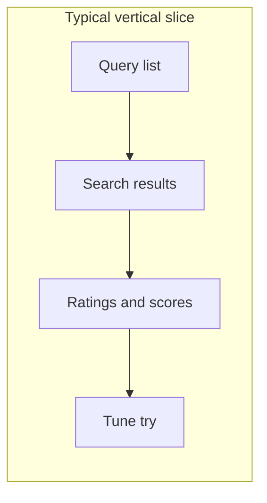

# AngularJS elimination plan (core case UI)

**What this is:** A roadmap for removing AngularJS from the **case evaluation workspace** (`/case/...`) while keeping **feature parity** with what ships on `main` today.

**What it is not:** A sprint backlog, a design spec, or a commitment to dates. It points to other docs for inventories and APIs.

---

## Start here

Read these five points first; everything below expands on them.

1. **Two stacks coexist.** 
    - Production case pages still use **Angular** (`QuepidApp`, `core.html.erb`). A parallel URL **`…/new_ui`** exercises **Rails + Stimulus + importmap** with **no** Angular bundle—this is the main **strangler** path ([Martin Fowler](https://martinfowler.com/bliki/StranglerFigApplication.html)).

2. **~~Strikethrough~~** in phase notes means **done for the scope called out** — almost always the **`new_ui`** slice or shared chrome (header, layout flags). It does **not** mean the default `/case/...` page is finished unless explicitly stated.

3. **Phases are tags, not a strict sequence.** Work ships as **vertical slices** (e.g. list + search + rate + score). Phases **3–6** overlap by design.

4. **P0 = “must not break on `main`.”** The detailed flow list and screenshot IDs live in **`angularjs_ui_inventory.md`**. Endpoint names and paths: **`workspace_api_usage.md`**.

5. **This doc is authoritative** for migration **scope**, **P0 parity**, **browser-side search** (`splainer-search` / `proxy/fetch` today; `search_executor` on `new_ui`), and **client scoring** (`ScorerFactory` / `scorer_executor`). Product-only ideas: **`intentional_design_changes.md`** section 2, with sign-off.

---

## Contents

- [Goals & boundaries](#goals)
- [Expectations (time and staffing)](#expectations-calendar-and-staffing)
- [Where the code lives today](#where-the-code-lives-today)
- [Target architecture](#target-architecture-directional)
- [Phases — overview](#phases--overview)
- [Phases — detail (0–10)](#phase-0--baseline-and-parity-checklist)
- [Feature areas → phases](#feature-areas--phases)
- [DevTools and `/proxy/fetch`](#browser-devtools-visibility-and-proxyfetch)
- [Risks](#risks-and-mitigations)
- [Testing, rollout, maintenance](#testing-strategy)
- [Related documentation](#related-documentation)
- [Status log](#status-log)

---

## Goals

1. **Remove AngularJS** from the production bundle for core evaluation (`ng-app`, `QuepidApp`, vendor JS).
2. **Preserve behavior** on `main` for `/case/:caseNo(/try/:tryNo)` and core chrome (actions, queries, results, tune relevance, modals, wizard, import/export, etc.).
3. **Follow existing patterns:** server-rendered shells, Stimulus for focused UI, forms + redirects, Pagy where lists are server-driven, relative URLs (project rules).
4. **Reduce long-term cost:** smaller JS payload, fewer Angular 1.x dependencies, clearer ownership (Rails vs browser).

## Expectations (calendar and staffing)

Full parity with today’s core UI is **multi-quarter** work (order of **~28** Angular controllers, **~20+** services, **~62** templates—see **`angularjs_inventory.md`**).

If you need it sooner, you must **shrink scope** (call out P1/P2) or **add people**. This document is a **map**, not a promise of a short project.

## Non-goals

Unless explicitly expanded later:

- Redesigning the core UX or information architecture.
- Replacing the **concept** of browser-driven interactive search (implementation may stay **non-Angular**—e.g. `splainer-search` or the newer **`search_executor`** modules).
- Re-implementing Rails pages that are **already** off Angular: admin, home, `/cases`, teams, scorers, books (non-core), **book judging** (`/books/.../judge`), auth/profile.

**Scope nuance**

- The **Judgements** item in the **core case action bar** (Angular modal, book sync, etc.) **is in scope** for this migration. The **separate Rails judging UI** is not the same thing and stays out of scope here.
- **Mapper wizard** and other flows that do **not** load the core Angular bundle are **out of scope** for this plan.

---

## Where the code lives today

### Default case workspace (Angular)

- **URLs:** `/case/:caseNo/try/:tryNo`, `/case/:caseNo`
- **Layout:** `app/views/layouts/core.html.erb` with `ng-app="QuepidApp"`
- **Routing:** `routes.js` → `MainCtrl` + `queriesLayout.html` — action bar, queries, results, tune pane, modals live in `ng-view`
- **Build output:** `yarn build` → `angular_app.js`, `quepid_angular_app.js`, `angular_templates.js` (plus jQuery, CSS, etc.)

### new_ui route (Stimulus only)

- **URL:** `GET /case/:id(/try/:try_number)/new_ui` → `CoreController#new_ui` (route name `case_core_new_ui`)
- **Layout:** `core_new_ui.html.erb` — same header/footer pattern as core, but **only** `application_modern` (importmap + Stimulus; no jQuery/Angular)
- **Body attributes:** `data-*` for case, try, scorer, and feature flags (see the layout file)

**What already works on `new_ui`**

- **Case header:** ~~inline rename~~; ~~case-level score badge~~ (`case-score`); ~~sparkline chart~~ (`sparkline` controller, D3 line graph of last 10 scores + annotation markers); ~~snapshot score badges during comparison~~ (`snapshotScores` target on `case-score`).
- **Query list:** ~~filter, sort, collapse-all, show-only-rated, Run all, add query, delete~~.
- **After expand:** browser **search** via **`search_executor`** (Solr / ES / OS; **`/proxy/fetch`** when the try is configured to proxy).
- **Ratings and scores:** **`ratings_store`**, **`scorer_executor`**, **`scorer.js`** (plus **`query_template.js`**, **`api_url.js`**).
- **Tune relevance (5-tab pane):** ~~query sandbox~~, ~~curator variables / tuning knobs~~, ~~settings (endpoint picker, fields, rows, escape)~~, ~~try history (rename/duplicate/delete)~~, ~~annotations (create/list/delete)~~, ~~CodeMirror JSON editor for non-Solr~~, ~~validation warnings~~.

**What is still missing on `new_ui`**

- Action bar links are **placeholders** (no modals wired) except: ~~Create snapshot~~, ~~Compare snapshots~~, ~~Clone~~, ~~Export~~, ~~Delete (delete all queries / archive / delete case)~~.
- Query list: ~~pagination~~, ~~drag-and-drop reorder~~, ~~query notes~~, ~~bulk actions~~ (~~Run All~~, ~~Score All per query~~, ~~bulk create via semicolons~~, ~~delete all queries~~), ~~full **result row** parity~~ (~~explain~~, ~~embeds~~, ~~smart field rendering~~, ~~frog~~, ~~querqy~~, ~~pagination~~, ~~browse link~~, ~~rank~~) with Angular.
- Annotations: per-query score breakdown not captured (see Phase 5 TODOs).

### Shared with both layouts

- **App header** is **ERB + Bootstrap 5** (`_header_core_app.html.erb`). It does **not** use `HeaderCtrl` in templates, but **`headerCtrl.js` still ships** in the Angular bundle—remove when you trim the bundle.
- **`application_modern`** is already loaded on **`core.html.erb`** next to Angular/jQuery, so Stimulus/Turbo are available on the default case page too (`Turbo.session.drive = false` globally).
- **`core.html.erb`** exposes `data-quepid-root-url`, `data-case-id`, feature flags on `<body>`, but an **inline script still duplicates** those values into Angular’s `configurationSvc`—**Phase 1 / 10** should leave a single source of truth.

### After migration

Consolidate **duplicate** flows (e.g. Angular **share case** vs Rails/Stimulus on `/cases`) once the core toolbar is fully migrated.

---

## Target architecture (directional)

Earlier Quepid migrations (teams, cases list, etc.) used:

- **Rails** for structure, authorization, and traditional forms.
- **Stimulus** for modals and small bits of client state.
- **Full page loads** where Turbo or complexity made that simpler.

The **core case UI** is heavier (live search, scoring, many modals). The end state is a **hybrid**:

1. **Server-rendered shell** — ERB (and optionally Turbo Frames) for layout, header, scaffolds for queries, tune panel, and result regions.
2. **Stimulus + plain ES modules** — query rows, ratings, pane resizing, modals, **Sortable.js** instead of `angular-ui-sortable`.
3. **Same JSON APIs** — still `api/cases/...` (`Api::V1`); only the **client** changes from `$http` to **`fetch`**. See **`api_client.md`** for CSRF and relative URLs.
4. **Libraries without Angular wrappers** where possible — CodeMirror 6 (replaces ACE for JSON editing), Vega/Vega-Lite, D3; search via splainer-style code or **`search_executor`**.

Default stack assumption: **Hotwire + Stimulus + targeted vanilla JS**, not a new SPA framework, unless the team decides otherwise.

---

## Phases — overview

Phases are **workstream labels**. You ship **slices** that cut across them (especially **3–6**). **Rating** work needs **scorer** logic **early**, not only in a late “charts” phase.

- **Phase 0** — Baseline: P0 flows, API mental model, tests, optional smoke.
- **Phase 1** — Config and navigation: flags, URLs, header bundle cleanup.
- **Phase 2** — Core shell: ERB chrome, Stimulus roots, east pane plan, events.
- **Phase 3** — Query list: CRUD, sort, filter, pagination, notes, bulk actions.
- **Phase 4** — Results and rating: rows, popovers, explain, finder, embeds.
- **Phase 5** — ~~Tune relevance: JSON editor, tries, annotations, endpoint picker, curator vars, validation.~~
- **Phase 6** — Charts and score polish: ~~sparklines~~, Vega, filters.
- **Phase 7** — Snapshots and diffs: ~~compare modal~~, ~~diff rendering~~, ~~header score badges~~, ~~clear/delete~~.
- **Phase 8** — Lifecycle: wizard, judgements, export/import, frog, delete.
- **Phase 9** — Tour, flash, loading, 404, footer, ACE config.
- **Phase 10** — Remove Angular from core: bundles, Karma, docs.

**Rollback:** Prefer **revert the PR**. Feature flags only when revert cost is high—see [Rollout](#rollout).

---

## Phase 0 — Baseline and parity checklist

**Purpose:** Agree what “must not break” before large refactors.

**Do**

- Keep **Karma** green while Angular remains; note gaps.
- Optional: **Playwright** (or `docs/scripts`) for P0 smoke; optional **bundle** spike for Phase 10.

**P0 flows (for merges to `main`)**

P1/P2 may slip behind a strangler boundary. Items with ~~strikethrough~~ are **verified on `…/new_ui`** only (screenshot IDs in the UI inventory).

- ~~**P0-1–6, 9–10**~~ — open case, list queries, add query, Solr + proxy search, rate document, case score in header, delete query, cases dropdown.
- ~~**P0-7 — Tune relevance (full)**~~ (SS-07) — east pane sandbox, rerun searches, ~~curator vars~~, ~~try management~~, ~~endpoint picker~~, ~~annotations~~, ~~JSON editor~~, ~~validation warnings~~.
- ~~**P0-8 — Snapshot**~~ (SS-12) — create from action bar.
- **Stretch (before Phase 10):** ~~**P0-S1** ES/OS on `new_ui`~~; ~~**P0-S2** clone (SS-17)~~; ~~**P0-S3** export CSV (SS-19)~~.

**P0 API surface (short)**

Authoritative listing: **`workspace_api_usage.md`**. In one breath: case + tries + queries (including bootstrap list) + ratings + case scores + snapshots + cases dropdown + current user + scorer + **`proxy/fetch`** (or direct engine) + feature flags on **`core.html.erb`** + client scorer evaluation + URL building ( **`api_url`** / `data-quepid-root-url` on `new_ui`).

**Search stack**

- **Default core:** **splainer-search** + Angular **`$http`**.
- **`new_ui`:** **`search_executor`** + **`query_template`** + **`api_url`** (`fetch`, preserves **`proxy_requests`**).

**Risk:** Moving **default** core off Angular without reusing or hardening these modules.

**Done when:** P0 list and API understanding are written down and the DRI says “good enough” to start slices.

---

## Phase 1 — Configuration and navigation

**Purpose:** One source of truth for flags and URLs; shrink dead JS.

- Stop **duplicating** feature flags into Angular’s **`configurationSvc`** once **`data-*`** on `<body>` is enough (or read DOM inside Angular temporarily).
- Enforce **relative** URLs on all new code (**`new_ui`** already uses **`api_url`**).
- Remove unused **`headerCtrl.js`** from the bundle when safe. **Create case** is already a Rails link; wizard after create stays Angular on default core until **Phase 8**.

**Done when:** Header is ERB-only in templates and config is not double-seeded.

---

## Phase 2 — Core shell + Stimulus bootstrap

**Purpose:** Static chrome does not have to live only inside Angular’s `ng-view`.

- **`new_ui`:** ~~Rails-driven chrome and `@queries`~~ from **`CoreController`** — **done**.
- **Default core:** still needs full **`CaseCtrl` / `CurrSettingsCtrl`** parity.
- **East pane:** replace **`paneSvc`** + jQuery sizing; consider **`resizable_pane_controller.js`**.
- **`broadcastSvc`:** map to DOM events or a tiny pub-sub before splitting **`MainCtrl`**.
- If you merge new chrome onto the **same** document as Angular, use **distinct IDs** to avoid collisions; **`new_ui`** today uses a **separate layout**.

**Done when:** `new_ui` proves the shell; default core can still be Angular below the header until later phases.

---

## Phase 3 — Query list (`QueriesCtrl`)

**Purpose:** Query CRUD, sort, filter, pagination, collapse, orchestration.

- **`new_ui`:** major slice is ~~done~~; see [new_ui route](#new_ui-route-stimulus-only) under **Where the code lives today**. ~~pagination~~ (client-side, 15/page), ~~SortableJS + reorder API~~, ~~query notes (SS-29)~~, ~~bulk actions~~ (~~Run All button~~, ~~Score All per query~~ via `bulkRateMenu` dropdown, ~~bulk create via semicolons~~ in add-query input, ~~delete all queries~~ via delete-case-options modal).
- ~~Replace **`dir-pagination-controls`** with Stimulus-driven paging~~ (client-side pagination in `query_list_controller.js`).

**Done when:** “Query List” section of the UI inventory is satisfied and tests cover order / add / filter.

---

## Phase 4 — Search results and rating

**Purpose:** Result rows, rating UX, and tooling around hits.

- **`new_ui`:** ~~basic JSON rows + rating + scorer helpers~~ — ~~full result row parity~~.
- ~~**Smart sub-field rendering**~~ — URLs auto-link, objects/arrays render as collapsible JSON (`
`), media URLs (images/audio/video) play inline. Uses shared `field_renderer.js` module.
- ~~**Media embeds**~~ (`media:fieldname` in field_spec) — inline audio/video/image players in result rows.
- ~~**Google Translate links**~~ (`translate:fieldname` in field_spec) — translation link icon next to field value.
- ~~**Frog icon**~~ — unrated results indicator with count badge in query header; updates live on rating changes.
- ~~**Querqy rule indicator**~~ — icon shown when Querqy rewrite or `querqy.infoLog` detected in debug response.
- ~~**Result pagination**~~ — "Peek at next page" button; appends results via offset re-search (Solr `start` / ES `from`).
- ~~**Browse on Solr link**~~ — "Browse N Results on Solr" button for Solr engines.
- ~~**Rank display**~~ — "Rank: #N" label on each result, accounting for pagination offset.
- ~~**Explain stacked chart**~~ — already done pre-Phase 4.
- ~~**Doc detail modal / Doc finder / Query explain / Bulk rate**~~ — already done pre-Phase 4.
- **Still open:** Doc cache patterns (deferred — low priority); BS5 popovers for rating (current vertical buttons work well).

**Done when:** Default core matches `main` for Solr/ES/OS when you cut it over; `new_ui` already exercises rate/unrate for the simple scale UI.

---

## Phase 5 — Tune relevance (try settings)

**Purpose:** Query params, tries, headers, history, JSON editor, annotations, endpoint picker.

~~CodeMirror JSON editor~~ (reused existing `modules/editor`), Stimulus forms, ~~try history~~, ~~try rename/duplicate/delete~~, ~~annotations~~ (create/list/delete), ~~search endpoint picker~~, ~~curator variables~~ (tuning knobs), ~~query param validation warnings~~; retire **ui-ace** and **angular-ui-bootstrap** pieces in the sandbox. Route shared widgets: **`json-explorer`** ↔ Phase 4; wizard/tags/csv ↔ Phase 8; countUp/ngclipboard ↔ web APIs.

**`new_ui` status:** 5-tab pane (Query, Tuning Knobs, Settings, History, Annotations) is ~~functional~~. All 6 slices implemented:

- ~~**Curator Variables (Tuning Knobs)**~~ — extracts `##varName##` from query params, renders numeric inputs, sends `curator_vars` in try creation payload. Filters magic vars (`$query`, `$keyword\d+`).
- ~~**Annotations**~~ — lazy-loaded list on tab switch, create with current score + message, delete individual annotations. Jbuilder includes `try_number` for display.
- ~~**Try management**~~ — rename (prompt → PUT), duplicate (POST clone → navigate), delete (with last-try guard + navigate-away if current try deleted).
- ~~**Search Endpoint picker**~~ — fetches case + user endpoints on Settings tab open, deduplicates, `<select>` dropdown, archived warning.
- ~~**CodeMirror JSON editor**~~ — reuses existing `modules/editor.js` `fromTextArea()` with new `onChange` callback (via `EditorView.updateListener`). Solr keeps plain textarea. Graceful fallback on init failure.
- ~~**Query param validation**~~ — Solr `deftype` → `defType` typo check, ES/OS template and `_source` warnings, TLS mismatch warning.

**Still open:** Nightly evaluation toggle + "Run in Background" button (deferred to Phase 8 lifecycle).

**Done when:** Try create/edit, headers, curator vars, history, and details modals work end-to-end.

### TODOs

- [ ] **Annotation score data is incomplete:** `_getCurrentScoreData()` in `settings_panel_controller.js` only reads the aggregate score from the case-score badge text. It always sends `allRated: false` and `queries: []` when creating annotations. The Angular version captured `lastScore.all_rated` and per-query score breakdowns. Fix: have `case_score_controller.js` store the full score payload (score, allRated, queryScores) as data attributes on its element when `updateScore()` is called, then read those in `_getCurrentScoreData()`.

---

## Phase 6 — Scoring display and charts

**Purpose:** Sparklines, Vega charts, header polish—not “when scoring starts.”

~~**`qgraph`** as a standalone function + Stimulus~~; **`angular-vega`** → **vega-embed** (align **Frog** with **Phase 8**); deepen scorer edge cases; remaining **filters** (`scoreDisplay`, `queryStateClass`, etc.).

**`new_ui` status:**

- ~~**Sparkline chart**~~ — `sparkline_controller.js` ports Angular's `qgraph` D3 line chart to Stimulus. Renders last 10 scores with annotation markers and tooltips. Uses fixed dimensions (150×80) matching the Angular layout. Hidden until score history has >1 entries, then shown via CSS `has-data` class.
- ~~**Score history fetch**~~ — `case_score_controller.js` fetches score history (`GET api/cases/:id/scores`) and annotations (`GET api/cases/:id/annotations`) on connect, pushes data to sparkline via Stimulus outlet.
- ~~**Score badge display**~~ — case-level and query-level score badges with `scoreToColor()` HSL mapping (continuous ratio, 0=red → 120°=green). Both `case_score_controller` and `query_row_controller` format scores to 2 decimal places.
- ~~**CSS sparkline styling**~~ — class-based `.sparkline-chart` selectors (alongside Angular's `qgraph` element selectors). Adjacent sparkline+badge layout with border-radius adjustments.
- **Still open:** **`angular-vega`** → **vega-embed** (deferred to Phase 8 with Frog); scorer edge cases (exotic scorer return types); `queryStateClass` filter (trivial — just prepends `queryHeader_`).

**Done when:** Header and chart UX match `main` for representative cases; per-query badges were already in motion from rating slices.

---

## Phase 7 — Snapshots and diffs

Snapshot modal (Rails + POST); diff as server page or Stimulus pane (`queryDiffResults.html`); **`snapshotSearcherSvc`** without Angular.

**Done on `new_ui`:**

- ~~**Snapshot creation modal**~~ (`snapshot` controller — Phase pre-7; already wired).
- ~~**Compare snapshots modal**~~ (`snapshot-comparison` controller): fetches snapshot list (`?shallow=true`), 1–3 dropdown selectors, duplicate/processing validation, delete snapshot from modal. Dispatches `snapshot-comparison:activate`/`deactivate` custom events on `document`.
- ~~**Side-by-side diff rendering**~~ in query rows (`renderDiffResults()` on `query-row` controller): current results vs snapshot columns using existing `.diff-container`/`.diff-row`/`.diff-column` CSS. Highlight classes: `.different` (yellow — doc moved position), `.missing` (red — doc absent from current results).
- ~~**Snapshot score badges in case header**~~ (`snapshotScores` target on `case-score` controller): shows average per-query score per snapshot with colored badges during comparison.
- ~~**Clear comparison**~~ from modal footer reverts all query rows to normal single-column view.
- ~~**Delete compared snapshot auto-clears**~~ comparison if the deleted snapshot was in active use.

**Still TODO:**

- Snapshot **import** modal (action bar "Import" link).
- Snapshot detail view / standalone snapshot page.
- Per-query snapshot scores in collapsed query row header (Angular shows scores inline).

---

## Phase 8 — Lifecycle modals and wizard

~~**WizardModalCtrl**~~ → stepped Stimulus or Turbo flows; ~~export/import~~; ~~**Judgements**~~ + **`bookSvc`**; Frog / debug / explain (**vega** → **vega-embed**); ~~**Unarchive**~~; ~~**delete-case-options**~~ (done — `delete_case_options_controller.js` with delete-all-queries / archive / delete).

**Done:**

- ~~Import modal~~ — `import_ratings_controller.js` with 3 tabs (Ratings CSV/RRE/LTR, Information Needs, Snapshots).
- ~~Export modal~~ — `export_case_controller.js` with 6 server-side formats.
- ~~Judgements modal~~ — `judgements_controller.js` with book selection, auto-sync toggles, manual Populate/Refresh/Sync Queries.
- ~~WizardModalCtrl~~ — `wizard_controller.js` 6-step BS5 modal. All 7 engine types (Solr/ES/OS/Vectara/Algolia/Static/SearchAPI). `modules/settings_validator.js` for endpoint validation + field discovery. `modules/wizard_settings.js` for engine defaults + TMDB demo detection. Auto-opens on `?showWizard=true`.
- ~~Unarchive~~ — `unarchive_controller.js` adds button to case header when case is archived. POSTs to existing `/cases/:id/unarchive`.

**TODO:**

- **Stale books data in Judgements modal:** Books are server-rendered as a JSON data attribute (`data-judgements-books-value`). If a user creates or shares a new book while the page is open, it won't appear until page reload. Investigate whether to add a lightweight fetch-on-open to refresh the book list, or whether the current behavior is acceptable.
- **Frog / debug / explain** — vega → vega-embed integration.

### Parity review items (Wizard + Unarchive)

These items need verification during or after implementation to ensure full feature parity with the Angular wizard:

- [ ] **TLS protocol switching:** Angular detects when the search endpoint URL uses a different protocol (HTTP vs HTTPS) than Quepid itself, and offers to reload Quepid on the matching protocol (passing wizard state via URL params: `searchEngine`, `searchUrl`, `caseName`, `apiMethod`, `basicAuthCredential`). Verify whether this is still relevant (most deployments are HTTPS now) and replicate if so. The proxy checkbox is the modern workaround, but the Angular wizard offers both options.
- [ ] **SearchAPI mapper code evaluation:** When validating an existing SearchAPI endpoint in the wizard, Angular evaluates the mapper code with `new Function()` to check that `numberOfResultsMapper()` and `docsMapper()` functions exist before making a test search. The Stimulus wizard must replicate this for the "Use Existing Endpoint" path when the selected endpoint is a SearchAPI engine.
- [ ] **Static CSV import → snapshot creation:** Angular's static engine path uses `ng-csv-import` for CSV upload, then calls `querySnapshotSvc.importSnapshotsToSpecificCase()` to create a snapshot from the CSV data and generate a special search URL (`/api/cases/:caseNo/snapshots/:snapshotId/search`). The Stimulus wizard needs a vanilla JS CSV parser and the same snapshot import API flow.
- [ ] **Post-wizard tour auto-start:** Angular triggers `setupAndStartTour()` 1500ms after the wizard closes if the user hasn't previously completed the case wizard. The `tour_controller.js` already exists on `new_ui` — verify that dispatching a `tour:start` event or calling `start()` after wizard close produces the same guided-tour experience.

**Done when:** “Modals” and “Case Action Bar” in **`angularjs_ui_inventory.md`** are satisfied.

---

## Phase 9 — Ancillary

~~Shepherd **tour**~~, ~~**flash**~~, ~~**loading**~~, ~~**404**~~, ~~**`footer.js`**~~, ~~**`ace_config.js`**~~. Revisit ActionCable if export/import gains background jobs on core.

**Done on `new_ui`:**

- ~~**Flash messages**~~ — centralized `flash_controller.js` on `#main-content` listens for `flash:show` CustomEvents and renders Bootstrap 5 dismissible alerts. Shared `modules/flash_helper.js` (`showFlash(msg, type)`) replaces ad-hoc `_showFlash()`, `_showAlert()`, and `alert()` calls across controllers. Also reads Rails flash from `data-rails-flash` attribute on page load.
- ~~**Loading states**~~ — query rows get `.loading` CSS class during search, dimming the header row. "Searching…" text replaced with a spinner animation (reuses `@keyframes spin` from `animation.css`).
- ~~**404 handling**~~ — `CoreController#new_ui` guards against nil `@case` and renders `_not_found.html.erb` partial with a "Back to Cases" link (HTTP 404 status).
- ~~**Tour**~~ — lightweight `tour_controller.js` replaces Shepherd.js with zero dependencies. Same 9 steps as the Angular tour, positioned tooltips with highlight overlay. Auto-starts on `?showWizard=true`, also triggered from "Tour" link in action bar. `tour_modern.css` for styling.
- ~~**Footer**~~ — already rendered in `new_ui.html.erb` (done in Phase 2).
- ~~**ACE config**~~ — not needed; CodeMirror replaced ACE in Phase 5. Cleanup in Phase 10.

---

## Phase 10 — Decommission Angular

**Purpose:** Remove Angular and jQuery from the core layout; pick final JS entrypoints.

~~**Stimulus already loads on `core.html.erb`**~~ — next step is **dropping** Angular/jQuery script tags, choosing **`core_*.js`** vs importmap-only for case code, and documenting the decision in **`DEVELOPER_GUIDE.md`**.

Also: delete unused Angular wiring, **`build_angular_*`**, trim **`package.json`**, plan **BS3 vs BS5** modals, replace Karma with a **pragmatic** mix of Vitest + system tests (full Jasmine port optional). Update **`docs/app_structure.md`**, **DEVELOPER_GUIDE**, AI context; remove duplicate **share_case**-style components.

**Done when:** `angular.module('QuepidApp'` does not appear in app code and the core layout matches the rest of the stack.

---

## Feature areas → phases

Use **`angularjs_ui_inventory.md`** for row-by-row acceptance. **Rough mapping:**

- Layout, flash, tour → **0**, **9**
- Header chrome → **1**
- Shell, resizable pane → **2**, **5**
- Query list → **3**
- Results, ratings, explain, finder, embeds → **4**
- Tune / annotations / endpoint → **5**
- Charts, Vega, sparklines → **6**
- Snapshots, diff → **7**
- Action bar lifecycle, judgements, wizard → **5–8**

~~**Strikethrough** inside phase sections~~ marks progress on **`new_ui`** or shared layout, per [Start here](#start-here).

---

## Browser DevTools visibility and `/proxy/fetch`

Operators often watch **Network** to see Solr/ES traffic. What they see depends on **where the request is sent from**, not whether the UI uses Angular or Stimulus.

**Today (default core)**

- Interactive search uses **splainer-search** with try settings.
- If **`proxy_requests`** is on, the browser calls same-origin **`/proxy/fetch?url=…`**; DevTools shows those calls. If proxy is off, you often see JSONP or direct engine calls.

**`new_ui`**

- **`search_executor`** keeps the same **proxy vs direct** idea with **`fetch`**.

**If you moved search entirely server-side**

- The browser might only show one Quepid API call—**unless** you add logging, a debug panel, or another **observability** story. That tradeoff is independent of Angular vs Stimulus. **`deangularjs-experimental`** often went that direction. **Nightly `run_evaluation`** is already server-side and is a different product path.

**Parity rule**

Keep **browser-originated** interactive search and **`proxy_requests`** behavior unless product **intentionally** changes observability. See also [Risks](#risks-and-mitigations).

---

## Risks and mitigations

- **Splainer / Angular on default core** — Reuse **`search_executor`** and **`query_template`** for cutover; see [Where the code lives](#where-the-code-lives-today) and [DevTools](#browser-devtools-visibility-and-proxyfetch).
- **ScorerFactory runs user code** — Keep sandboxing; isolate module; test thoroughly.
- **WizardModalCtrl size** — Time-box spikes; consider a multi-page wizard.
- **Large cases** — Prefer server pagination and lazy loading; use `thor sample_data:large_data` to stress-test.
- **HTTP / Solr JSONP** — Preserve **`ssl_options`** assumptions.
- **Regression volume** — Prefer small merges; use the UI inventory as a checklist; optional Playwright.
- **Bootstrap 3 vs 5 in core** — Schedule a visual pass against screenshots.
- **`broadcastSvc`** — Document every consumer before removing Angular.
- **DevTools / proxy story** — Do not move search server-only without a documented substitute for operators.
- **Proxy abuse** — **`ProxyController`** forwards headers; review security when behavior changes.
- **Staffing** — Narrow P0 or add review bandwidth.

---

## Testing strategy

1. **Minitest** — keep green; add tests when Rails APIs change.
2. **Karma** — green while Angular ships; prefer **targeted** tests on extracted pure JS.
3. **Vitest** — **`yarn test:vitest`**; tests under **`test/javascript/`** (e.g. `search_executor`, `query_row`). Does not replace Karma until you migrate specs.
4. **After Angular** — unit tests on extracted modules + a **small** system suite for P0; full Jasmine→Vitest port optional.
5. **Manual** — run P0 after each slice; full inventory pass before major releases or Phase 10.

## Rollout

Ship to **`main`** via normal PRs. **Revert** is the default rollback. Use **feature flags** only when revert is too expensive. Decide **bundle / Turbo** shape early (Phase 10). Update changelog and user-facing docs when behavior or URLs change.

## Maintenance

- Assign a **DRI** per phase where helpful.
- Hold **architecture review** before the first slice that replaces **query + search + rate**, and again before **Wizard / Judgements** (Phase 8).
- Append to the **status log** when meaningful progress lands.

---

## Status log

- **2026-03-19** — Initial plan; judgements scope; API wording; `broadcastSvc` / `paneSvc`; query notes; doc finder; stacked charts / embeds / Frog+Vega; BS3/BS5; Phase 0 services; `application_modern`; related docs; DevTools/proxy parity; pragmatic review folded in.
- **2026-03-20** — P0 flow checklist + compact API summary in this doc.
- **2026-03-21** — Synced `new_ui` (search_executor, ratings, case-score, Run all, layout `data-*`); strikethrough legend; dedupe pass. **Readable rewrite:** “Start here,” TOC, mermaid slice diagram, consistent phase subheads, grouped related docs. **Lists-only:** no markdown tables (Angular vs `new_ui`, phase overview, risks); subsection **`new_ui` route** for a stable anchor; Phase 3 links there.
- **2026-03-22** — **Phase 5 complete** (all 6 slices): 5-tab tune relevance pane on `new_ui` — curator variables (tuning knobs), annotations (CRUD), try management (rename/duplicate/delete), search endpoint picker, CodeMirror JSON editor (reused `modules/editor` instead of ACE), query param validation warnings. Visual parity screenshots captured for all 5 tabs. Known gap: annotation score data missing `allRated` and per-query breakdown (TODO in Phase 5). Added `onChange` callback to `fromTextArea()` in `modules/editor.js`. Fixed N+1 in annotations controller (`includes(:user, score: :try)`). Added `try_number` to annotation jbuilder.
- **2026-03-22** — **Phase 6 sparkline**: ported Angular `qgraph` D3 line chart to `sparkline_controller.js`. Case header now shows sparkline of last 10 scores with annotation markers when score history has >1 entries. `case_score_controller.js` fetches score history + annotations on connect and pushes to sparkline via outlet. Class-based CSS (`.sparkline-chart`) alongside Angular element selectors. Vitest coverage for sparkline rendering, annotation filtering, re-render on data change, tooltip lifecycle. Vega migration deferred to Phase 8 (Frog).
- **2026-03-22** — **Phase 3 bulk actions complete**: Added "Run All" button to query list toolbar. Wired action bar "Delete" link to new `delete_case_options_controller.js` BS5 modal with three actions: Delete All Queries (API `DELETE /api/bulk/cases/:id/queries/delete`), Archive Case (`POST /cases/:id/archive`), Delete Case (API `DELETE /api/v1/cases/:id`). Confirmed existing bulk features: Score All per-query dropdown (`bulkRate` in `query_row_controller`), bulk create via semicolons in add-query input. Vitest coverage (7 tests). Phase 3 marked done.
- **2026-03-23** — **Phase 9 ancillary features**: (1) Flash messages — centralized `flash_controller.js` + `modules/flash_helper.js` replaces 6+ ad-hoc `_showFlash`/`alert()` patterns; renders Bootstrap 5 alerts on `#main-content`, reads Rails flash on page load. Migrated `snapshot_controller` and `query_row_controller` to use `showFlash()`. (2) Loading states — query rows get `.loading` class during search (opacity dim on header); "Searching…" text replaced with spinner. (3) 404 handling — `CoreController#new_ui` guards nil `@case`, renders `_not_found.html.erb` with 404 status. (4) Tour — lightweight `tour_controller.js` (zero npm deps) replaces Shepherd.js; 9 steps, positioned tooltips with overlay backdrop; auto-starts on `?showWizard=true` or from action bar "Tour" link; `tour_modern.css`. Footer already done (Phase 2). ACE config not needed (CodeMirror in Phase 5). Phase 9 complete.
- **2026-03-23** — **Phase 4 result row parity**: 7 features added to `new_ui` result rows. (1) Smart sub-field rendering via `field_renderer.js` — URLs auto-link, objects/arrays render as collapsible `
` JSON, media URLs play inline. (2) Media embeds — `media:fieldname` in field_spec renders audio/video/image players. (3) Google Translate links — `translate:fieldname` shows translate icon next to field value. (4) Frog icon — unrated results indicator with count badge in query header, updates live on rating changes. (5) Querqy rule indicator — icon shown when Querqy rewrite detected in debug response. (6) Result pagination — "Peek at next page" button appends results via offset re-search (Solr `start` / ES `from`). (7) Browse link — "Browse N Results on Solr" button. Also: rank display ("Rank: #N") per result. Added `media` and `translations` arrays to `parseFieldSpec()` and `normalizeDoc()` in `search_executor.js`. Vitest: 3 new tests for field spec parsing (178 total, all passing). Phase 4 substantially complete.
- **2026-03-23** — **Phase 8 Wizard + Unarchive**: (1) Case creation wizard — `wizard_controller.js` (6-step BS5 modal) replaces Angular `WizardModalCtrl`. All 7 engine types supported (Solr/ES/OS/Vectara/Algolia/Static/SearchAPI). New `modules/settings_validator.js` replaces `SettingsValidatorFactory` from splainer-search (probe search + field discovery). New `modules/wizard_settings.js` ports `settingsSvc` defaults/TMDB settings. Wizard modal added to `_action_bar_modals.html.erb`. Auto-opens on `?showWizard=true`. Supports: engine radio buttons with logos, URL validation ("ping it"), Advanced panel (proxy/auth/headers), existing endpoint picker, Solr API method, SearchAPI mapper wizard redirect, Static CSV upload with field/query extraction, field autocomplete via `<datalist>`, query tag management, TMDB demo detection with optimized defaults, "Skip Validation" fallback. On finish: updates try via `PUT /api/cases/:id/tries/:tryNo`, renames case, creates queries. (2) Unarchive flow — `unarchive_controller.js` adds "Unarchive" button to case header next to ARCHIVED badge, POSTs to existing `/cases/:id/unarchive` route. Vitest: 33 new tests (211 total, all passing). Parity review items documented in Phase 8 TODO section.

---

## Appendix: Review summary (historical)

The **pragmatic engineer review** is incorporated throughout: [Expectations](#expectations-calendar-and-staffing), [Phases](#phases--overview), Phases **0 / 4 / 6 / 10**, [Testing](#testing-strategy), [Rollout](#rollout), [Risks](#risks-and-mitigations), and [DevTools](#browser-devtools-visibility-and-proxyfetch).
