# Core Case Evaluation Interface Manual

This manual describes the **core case evaluation interface** in Quepid: the main screen where you work with a case, its queries, search results, ratings, and scores. It is the primary workspace for tuning search relevance. Screenshots are referenced throughout; to capture or update them, see [Screenshot Guide for Core Case Evaluation Manual](core_case_evaluation_manual_screenshots.md). Image files live in `docs/images/core_case_evaluation_manual/`; paths use `../images/core_case_evaluation_manual/` so they resolve correctly from this file under `docs/migration/`. **Figures are shown at reduced width (640px) for readability; click an image to open the full-size PNG** (same URL as the image `src`).

Quepid is **migrating** this screen from the **AngularJS** app to **Rails views + Stimulus** (`core_new_ui` layout, `app/views/core/*`). The **case actions bar** uses **Compare snapshots**, **Import**, **Clone**, and **Export**; the `new_ui` shell should use the same labels for parity. Other controls may differ by build while features are ported; where behavior exists only on one stack, this manual calls that out.

For **engineering behavior** (bootstrap, flash, APIs) and the **Angular removal plan**, see [workspace_behavior.md](./workspace_behavior.md) and [angularjs_elimination_plan.md](./angularjs_elimination_plan.md). **`deangularjs-experimental`** is documented separately in [deangularjs_experimental_review.md](./deangularjs_experimental_review.md)—not the default target for `main`.

## Overview

The core case evaluation interface loads when you open a specific case and try (Rails-rendered shell plus legacy Angular where features have not been ported yet). It lets you:

- View and manage the case’s **queries**
- Run those queries against your **search endpoint** and see **results**
- **Rate** results (relevance judgments)
- See **scores** at query and case level from your chosen **scorer**
- Adjust **try settings** (query template, tuning knobs, endpoint) and **rerun** searches
- Create **snapshots** and **compare snapshots** with current results
- Perform case-level actions from the actions bar (scorer, judgements, snapshots, import/export, share, clone, delete, and related modals)

Everything in this interface is scoped to one **case** and one **try** (a configuration snapshot of that case).

## Access and URL

- **URL pattern:** `/case/:caseNo/try/:tryNo` (case number and try number in the route).  
  Example: `/case/42/try/1` is case 42, try 1.
- If you omit the try, the latest try for that case is used.
- You reach this interface by:
  - Choosing a case from the **Relevancy Cases** dropdown in the header, or
  - Opening a case from the cases list and (if needed) selecting a try.

The interface loads the case and try, fetches queries, runs all queries against the current try’s search endpoint, and then displays results and scores.

On first load you may see a **Loading...** state while the page loads; during bulk query runs, progress messaging may appear (e.g. legacy **Bootstrapping Queries** / **Updating Queries: X / Y**; wording may differ on the migrated stack).

<a href="../images/core_case_evaluation_manual/16_loading_bootstrapping.png" title="Open full-size image">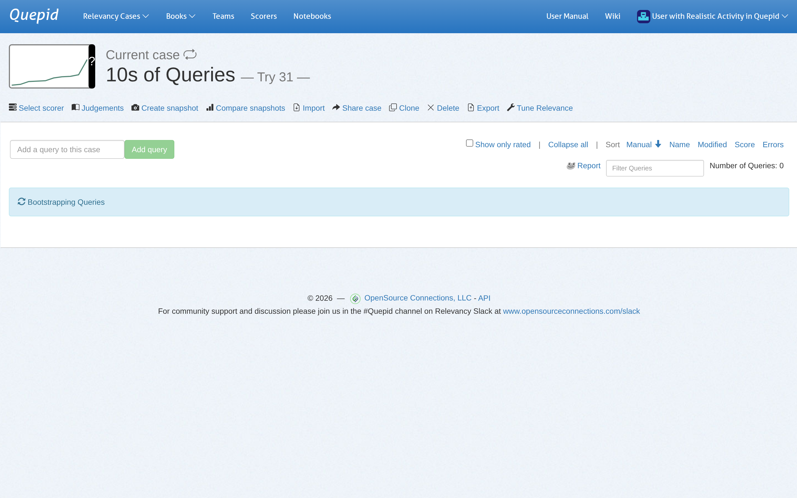</a>

Success and error feedback appear in **flash messages** at the top of the page (e.g. “All queries finished successfully!” or “Some queries failed to resolve!”). Search-specific errors can appear in a dedicated search-error area.

<a href="../images/core_case_evaluation_manual/70_flash_messages.png" title="Open full-size image">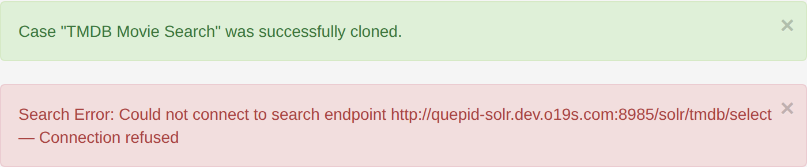</a>

If you have no cases yet (or the URL has `showWizard=true`), the **case creation wizard** may open automatically. You can also open it from the header via “Create a case” under Relevancy Cases. The wizard walks through selecting or creating a search endpoint, configuring it, adding initial queries, and creating the case.

## Layout

<a href="../images/core_case_evaluation_manual/01_full_layout.png" title="Open full-size image">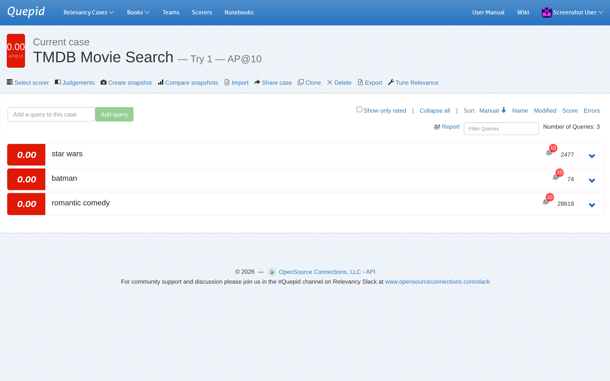</a>

The screen is divided into:

1. **Header** (top) – Global nav: Relevancy Cases, Books, Teams, Scorers, Notebooks, user menu, User Manual, Wiki.
2. **Main area** – Case title, case-level score, case actions bar, then the **query list** (each query expandable to show results and tools).
3. **East pane** (optional) – **Tune Relevance** panel: try settings, query sandbox, tuning knobs, history, annotations. Shown/hidden via “Tune Relevance.” The east pane is **resizable**: drag the vertical divider (east-slider) between the main area and the panel to change its width.

During migration, the **case title / score header** may be rendered from the Rails partial [`app/views/core/_case_header.html.erb`](../../app/views/core/_case_header.html.erb) while the **case actions bar** and **query list** still come from the Angular template [`app/assets/templates/views/queriesLayout.html`](../../app/assets/templates/views/queriesLayout.html) (see **Angular implementation reference** below).

---

## Header

<a href="../images/core_case_evaluation_manual/02_header_relevancy_cases.png" title="Open full-size image">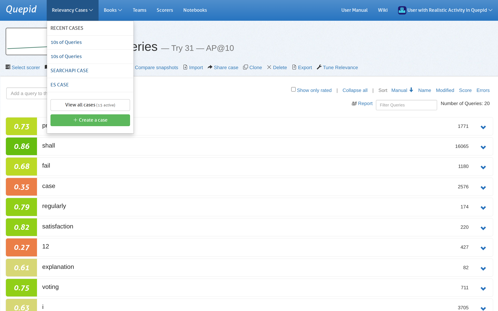</a>

- **Relevancy Cases** – Recent cases; “View all cases”; “Create a case.”
- **Books** – Recent books; “View all books”; “Create a book.”
- **Teams** – Teams management.
- **Scorers** – Scorers list.
- **Notebooks** – Link to Notebooks.
- **User menu** – Profile, Log out, API Docs; for admins: Admin, Users, Announcements, Job Manager.
- **User Manual** / **Wiki** – External docs.

Use the case dropdown to switch cases (and optionally tries) without leaving the core interface.

---

## Case Header

<a href="../images/core_case_evaluation_manual/03_case_header_and_actions.png" title="Open full-size image">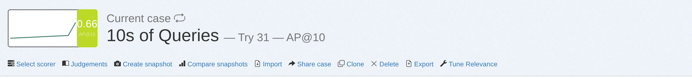</a>

At the top of the main area:

- **Case score** – One or more score badges (e.g. **qscore-case**):
  - Current case score from the active scorer.
  - When the case has more than one saved score, a **score history graph** (sparkline) and **annotation** markers appear in the badge, showing how the case score changed over time.
  - When **Compare snapshots** is active, additional scores for each snapshot/searcher in the comparison.
- **Case name** – Double‑click to rename (inline edit).
- **Try name** – e.g. “Try 1”; double‑click to rename (inline edit).
- **Scorer name** – The case’s selected scorer (e.g. “AP@10”).
- **Badges** – “PUBLIC,” “ARCHIVED,” or nightly icon if the case is marked for nightly evaluation.

<a href="../images/core_case_evaluation_manual/73_case_header_badges.png" title="Open full-size image">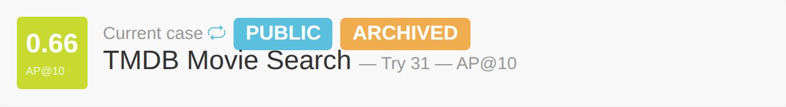</a>

<a href="../images/core_case_evaluation_manual/48_inline_case_name_edit.png" title="Open full-size image">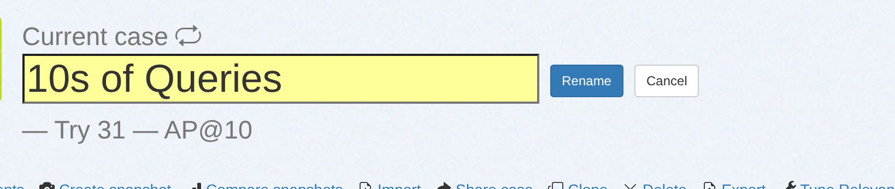</a>

---

## Case Actions Bar

Below the case header is a horizontal list of actions:

| Action | Description |
|--------|-------------|
| **Select scorer** | Open modal to choose the case’s scorer (e.g. AP@10, NDCG@10, custom). |
| **Judgements** | Open modal to associate a **Book** with this case and to refresh the case’s ratings from that book’s judgements (or to manage the book–case link). |
| **Create snapshot** | Save current query results as a named snapshot for later comparison. |
| **Compare snapshots** | Choose one or more snapshots to compare with current results (side‑by‑side). |
| **Import** | Import ratings from file (CSV, RRE, LTR, etc.) into this case. |
| **Share case** | Share the case with teams. |
| **Clone** | Duplicate the case (queries, ratings, settings). |
| **Delete** | Open modal: **Delete All Queries** (removes all queries and their ratings), **Archive Case** (hide case; find it later via “Archived Cases” on the cases list), or **Delete Case** (permanently remove the case). |
| **Export** | Export case/ratings in various formats (CSV, TREC, RRE, LTR, etc.). |
| **Tune Relevance** | Show or hide the east pane (try settings, query sandbox, knobs, history, annotations). |

<a href="../images/core_case_evaluation_manual/14_select_scorer_modal.png" title="Open full-size image">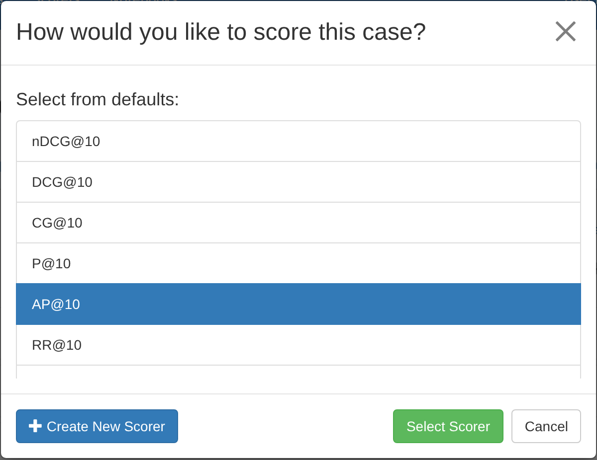</a>

<a href="../images/core_case_evaluation_manual/15_delete_options_modal.png" title="Open full-size image">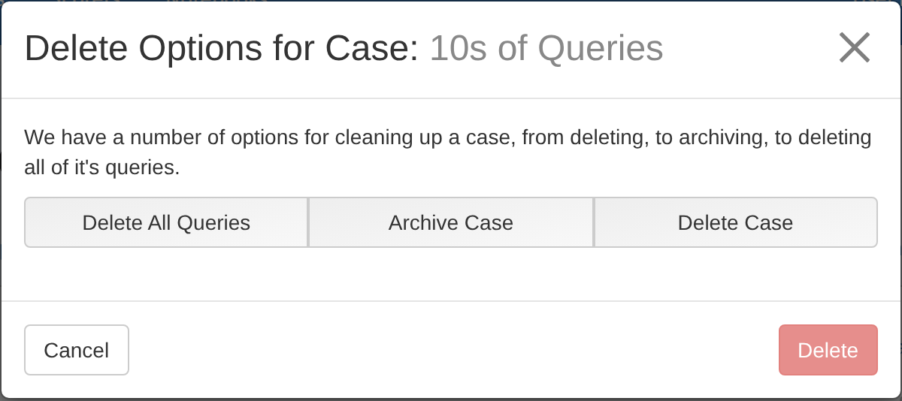</a>

All of these apply to the **current case** (and effectively to the current try for settings that are try-specific).

### Case action modals (legacy Angular)

The following modals are opened from the actions bar in the Angular-backed UI (`queriesLayout.html`).

<a href="../images/core_case_evaluation_manual/21_judgements_modal.png" title="Open full-size image">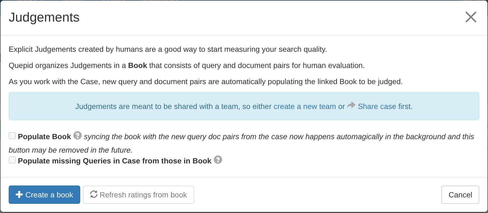</a>

<a href="../images/core_case_evaluation_manual/20_import_ratings_modal.png" title="Open full-size image">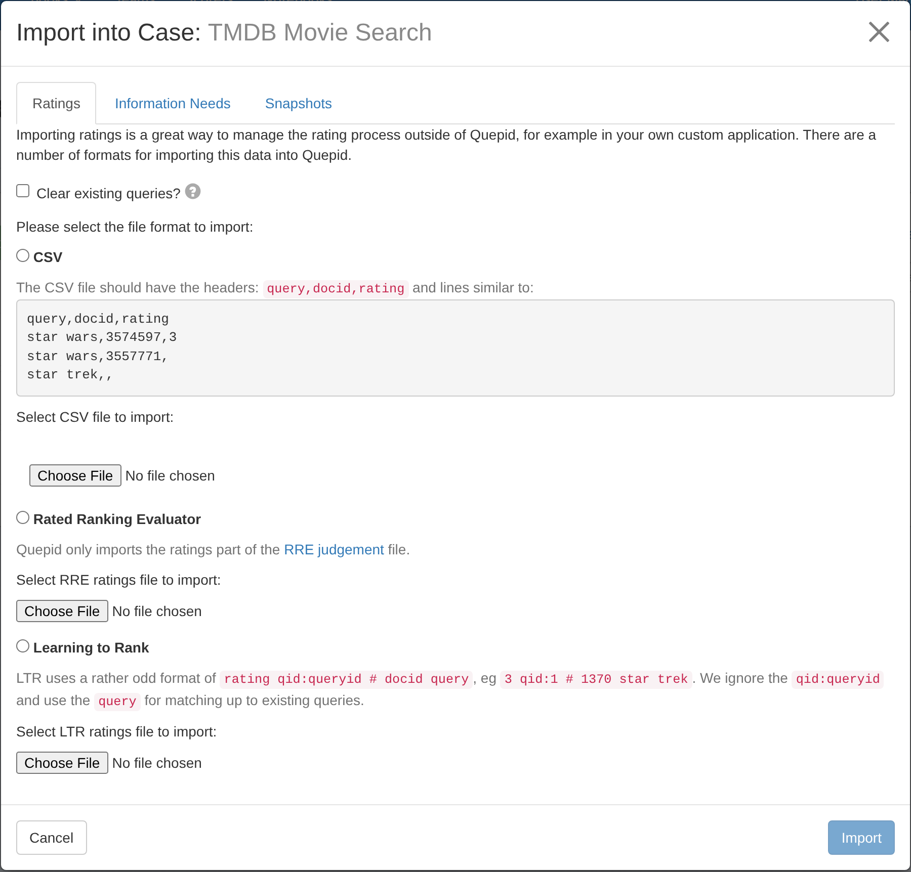</a>

<a href="../images/core_case_evaluation_manual/18_share_case_modal.png" title="Open full-size image">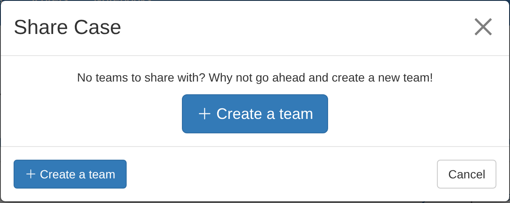</a>

<a href="../images/core_case_evaluation_manual/17_clone_case_modal.png" title="Open full-size image">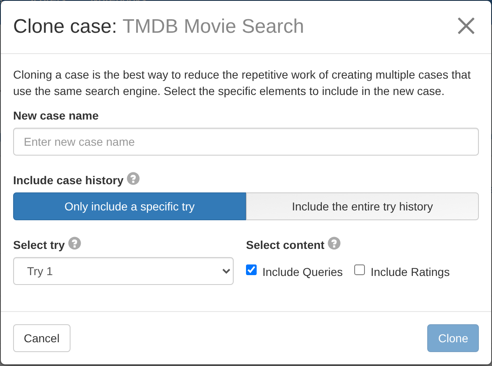</a>

<a href="../images/core_case_evaluation_manual/19_export_case_modal.png" title="Open full-size image">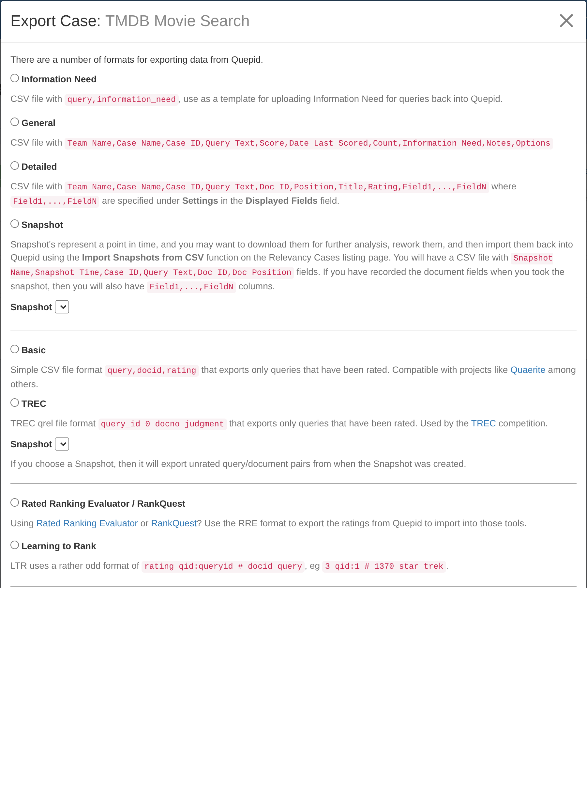</a>

### Alternate delete / archive flows

Some builds or entry points use simpler confirmations: a **direct delete case** dialog or **archive case** confirmation from the cases list. The three-option modal above remains the primary **Delete** flow from the core actions bar.

<a href="../images/core_case_evaluation_manual/71_delete_case_simple_modal.png" title="Open full-size image">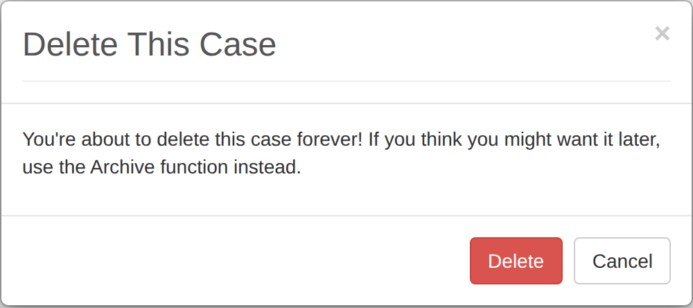</a>

<a href="../images/core_case_evaluation_manual/52_archive_case_confirm.png" title="Open full-size image">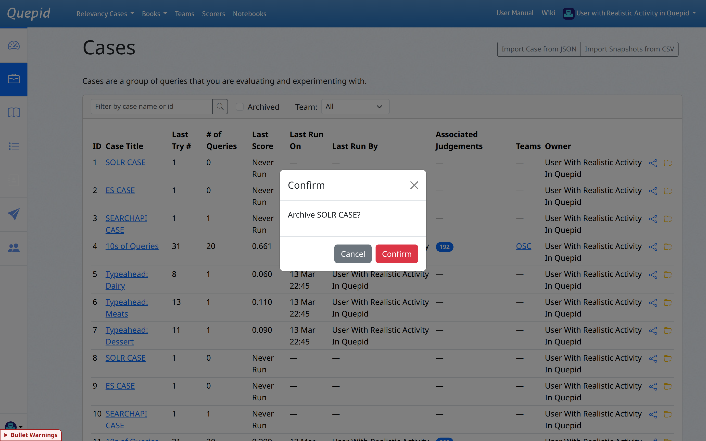</a>

---

## Query List

<a href="../images/core_case_evaluation_manual/04_query_list_controls.png" title="Open full-size image">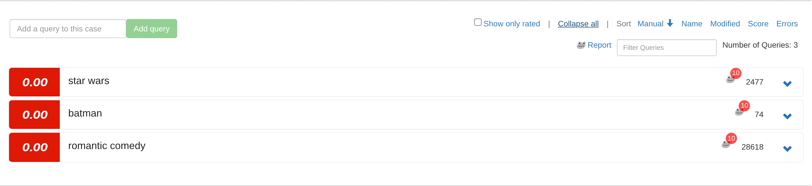</a>

The main content is a list of **queries** for the case. Each row summarizes one query; expanding it shows results and per‑query tools.

### List-Level Controls

- **Run All** – On the **Rails + Stimulus** query list shell, runs searches for all queries (play icon + “Run All”). The legacy Angular list may auto-run on load instead of exposing this control; behavior depends on your build.
- **Add query** – Create a new query: enter query text and add. You can add **multiple queries at once** by separating query text with **semicolons** (`;`); each non-empty segment becomes a new query, and all are run after being added (legacy behavior; confirm for your build if the new add-query flow differs).
- **Show only rated** – Checkbox: when on, each query’s result list shows only **documents that have been rated** (instead of the full result set). The query list itself is unchanged; all queries still appear.
- **Collapse all** – Collapse every query row.
- **Sort** – Sort the list by:
  - **Manual** – Custom order (drag‑and‑drop if enabled by configuration).
  - **Name** – Query text.
  - **Modified** – Last modified.
  - **Score** – Last score.
  - **Errors** – Queries with errors first.
  Arrow indicates ascending/descending; click again to flip.
- **Filter** – Text filter (placeholder e.g. **Filter Queries** on the Stimulus shell) to show only queries whose text matches.
- **Number of Queries** – Total count.
- **FROG report** – Link to the FROG (Focusing on Retrieval Optimization Goals) report for the case. Common on the **legacy** query list; the Stimulus shell may omit it until parity. Opening it shows summary stats and a distribution of queries by missing-rating count.

<a href="../images/core_case_evaluation_manual/22_frog_report_modal.png" title="Open full-size image">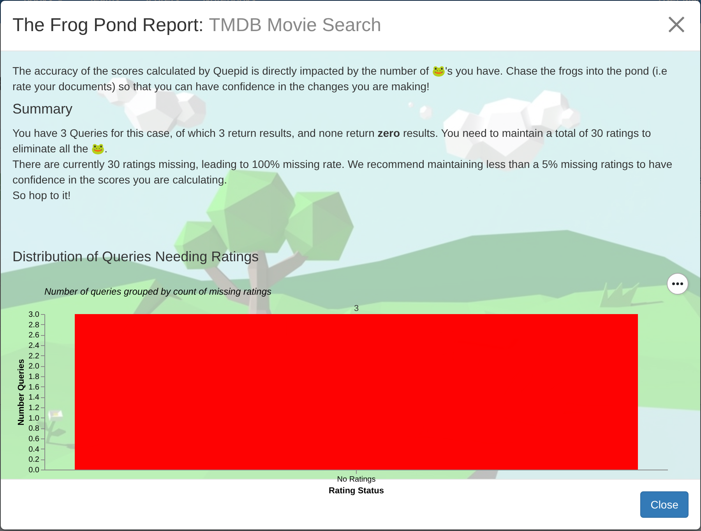</a>

Queries may be **paginated** (e.g. default 15 per page on the legacy list); use paging controls at the bottom when your build shows them.

<a href="../images/core_case_evaluation_manual/62_pagination_controls.png" title="Open full-size image">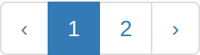</a>

When **Manual** sort is enabled, the legacy list supports **drag-and-drop** reorder (`ui-sortable` on the query list).

<a href="../images/core_case_evaluation_manual/80_drag_drop_reorder.png" title="Open full-size image">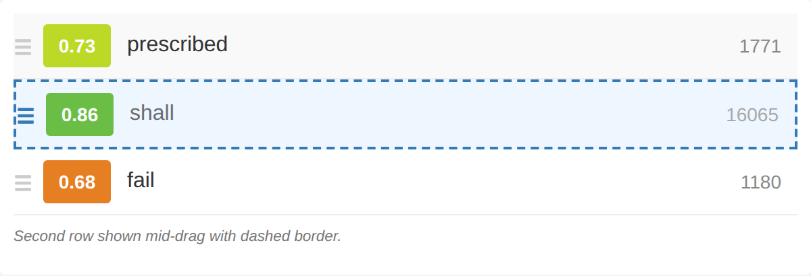</a>

If an administrator has disabled manual sorting, the Angular UI shows **Manual** as plain text with a warning icon; hover the icon for an explanation ([Quepid issue #272](https://github.com/o19s/quepid/issues/272)).

### Per-Query Row (Collapsed)

Each list row shows:

- **Query score** – From the case scorer (and, when **Compare snapshots** is active, scores for each snapshot in the comparison).
- **Query text** – The search phrase (tooltip can show “Info Need” if set).
- **Result count** – e.g. “47 Results.”
- **Warning icon** – Shown if the query had an error (e.g. search failure).
- **Unrated indicator** – e.g. frog icon + count of missing ratings when not all shown results are rated.
- **Querqy icon** – Shown when a Querqy rule was triggered for this query (if applicable).
- **Expand/collapse** – Click to open or close the row.

When a query’s search fails, the row can show a distinct **error** styling (badge and warning) in addition to the header warning icon.

<a href="../images/core_case_evaluation_manual/75_query_error_state.png" title="Open full-size image">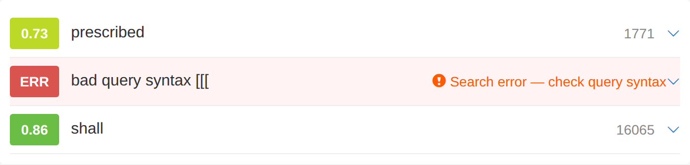</a>

Click the row (or the expand control) to expand.

### Per-Query Row (Expanded)

<a href="../images/core_case_evaluation_manual/05_query_expanded.png" title="Open full-size image">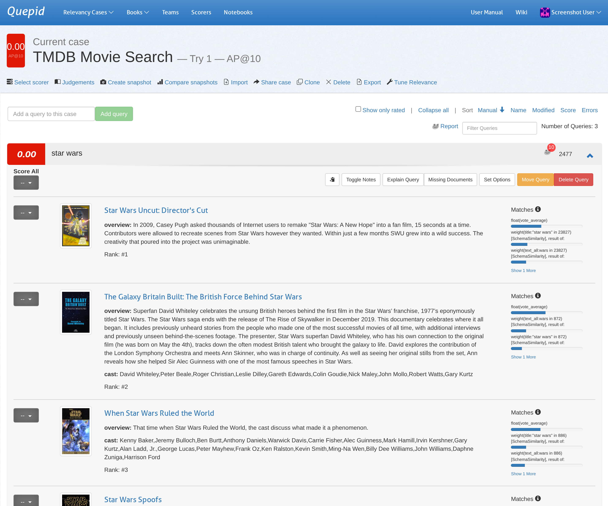</a>

When expanded, you get at least:

- **Re-run** – Run the search for this query only (present on the Stimulus shell).
- **Delete Query** – Remove this query from the case.

On the **legacy Angular** expanded row you also typically get:

- **Score All** – One place to set the rating for this query (e.g. default rating for the whole query). Opens the same rating scale popover as on individual docs.
- **Toolbar:**
  - **Copy** – Copy query text.
  - **Toggle Notes** – Show/hide the notes and “Information Need” fields.
  - **Query Explain** – Open explanation for how the query was executed (e.g. explain API).
  - **Missing Documents** – Open advanced search (e.g. by doc ID or query) to find and rate documents not in the current result set.
  - **Query options** – Per‑query overrides (e.g. custom scorer, options).
  - **Move query** – Move this query to another case.
- **Notes / Information Need** – Editable “Information Need” and “Notes on this Query” (saved on Save).
- **Comparison view** – When **Compare snapshots** is active, side‑by‑side results for this query vs selected snapshot(s) (e.g. **Current Results** vs snapshot columns).
- **Search results** – List of documents (or “Rated only” when “Show only rated” is on). For each result:
  - **Rating control** – Click to open the **rating popover**: choose a numeric rating from the scorer’s scale (and optional label). **RESET** clears the rating.
  - **Title** – Often a link; click to open the **detailed document** modal (all fields).
  - **Snippets / fields** – Displayed according to the try’s “Displayed fields” (and any thumbnails, media, translations if configured). Fields can show as plain text, links, or expandable JSON. **Document errors** (e.g. “This document can’t be uniquely identified…”) appear when the backend cannot store ratings for that result.
  - **Explain** – If available, a way to open explain for that doc, and a **stacked chart** (score breakdown) showing how the document’s score was computed (e.g. from Solr/ES explain).
- **Peek at next page** – Load more results for this query (when the endpoint returns more).
- **Browse on Solr** – For Solr, link to browse all results in the engine (if applicable).
- **Depth of rating note** – If the scorer only uses the top N results, a note like “Only the top N results are used in the scoring” or “Results above are counted in scoring” at the cutoff rank.

When “Show only rated” is on, the result list and “Peek at next page” are limited to **rated** documents only.

#### Figures: notes, peek/browse, toolbar modals, Score All, matches, document view

<a href="../images/core_case_evaluation_manual/29_notes_information_need.png" title="Open full-size image">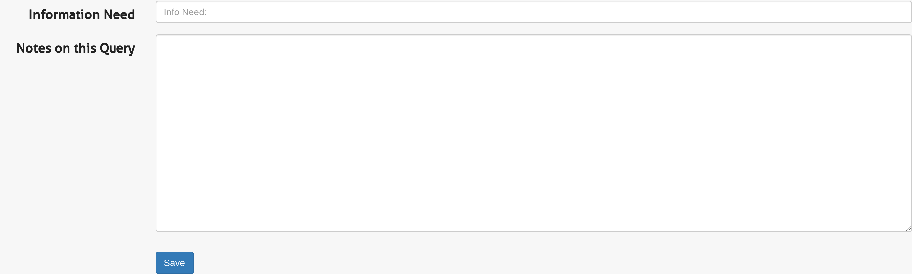</a>

<a href="../images/core_case_evaluation_manual/30_peek_browse_results.png" title="Open full-size image">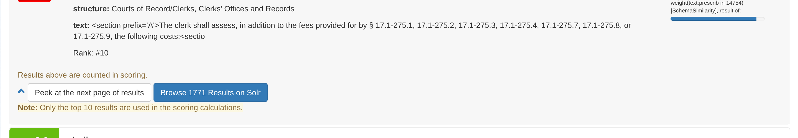</a>

<a href="../images/core_case_evaluation_manual/23_query_explain_modal.png" title="Open full-size image">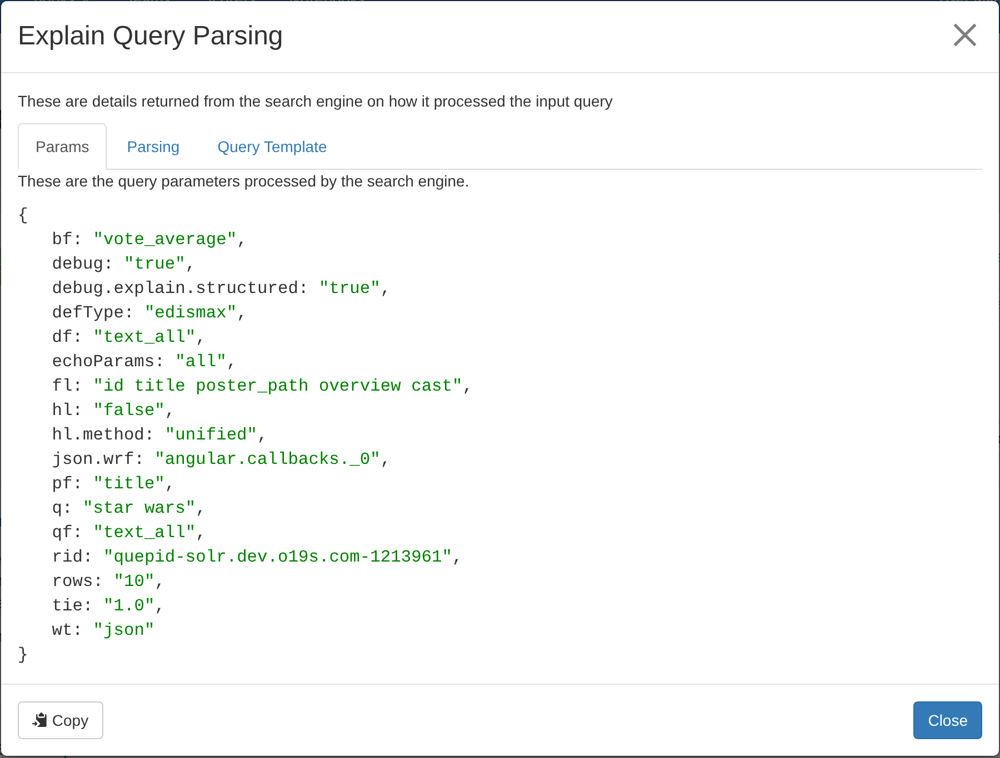</a>

<a href="../images/core_case_evaluation_manual/24_targeted_search_modal.png" title="Open full-size image">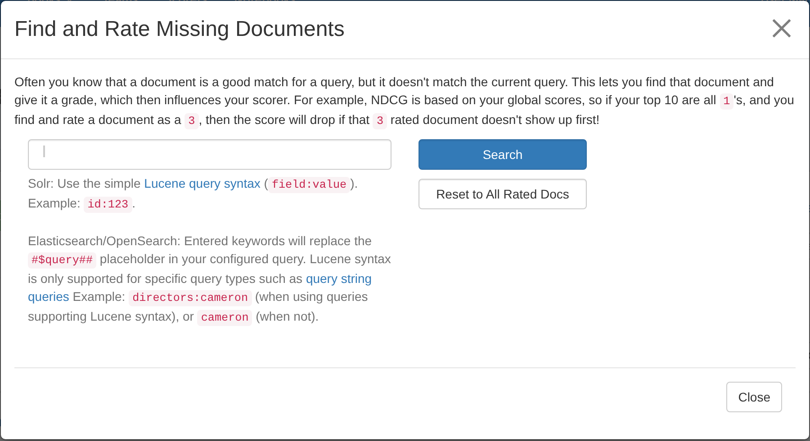</a>

<a href="../images/core_case_evaluation_manual/25_query_options_modal.png" title="Open full-size image">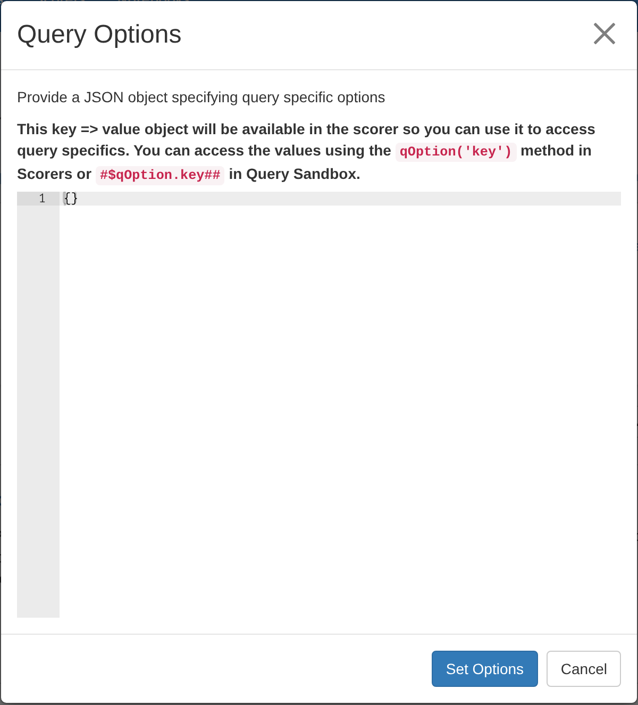</a>

<a href="../images/core_case_evaluation_manual/26_move_query_modal.png" title="Open full-size image">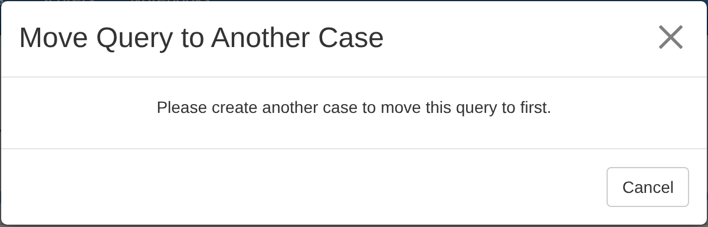</a>

<a href="../images/core_case_evaluation_manual/27_detailed_document_modal.png" title="Open full-size image">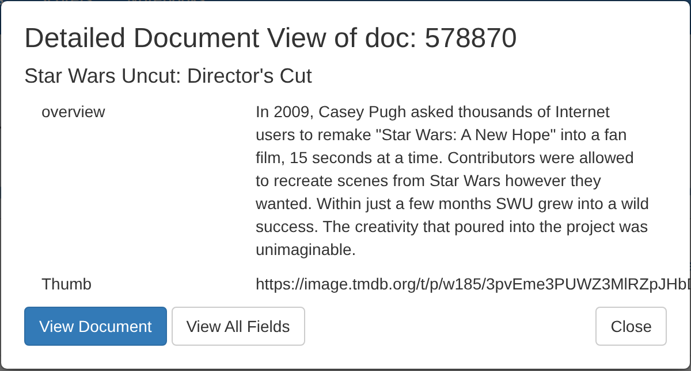</a>

<a href="../images/core_case_evaluation_manual/49_bulk_rating_score_all.png" title="Open full-size image">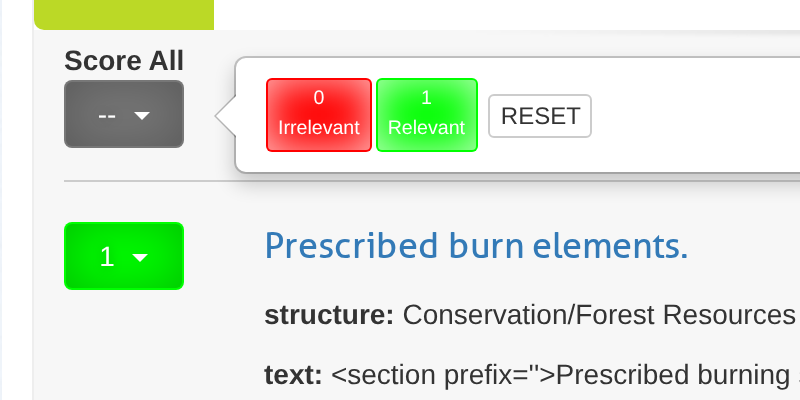</a>

<a href="../images/core_case_evaluation_manual/28_matches_explain.png" title="Open full-size image">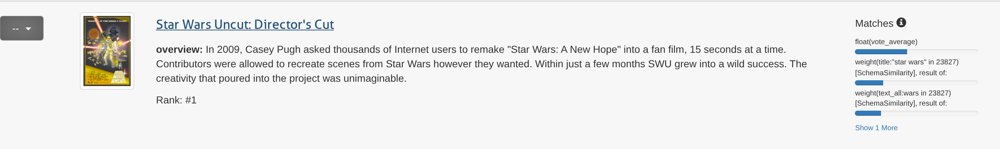</a>

Some engines expose **Debug** and **Expand** actions on a result for deep inspection of scoring.

<a href="../images/core_case_evaluation_manual/79_debug_expand_buttons.png" title="Open full-size image">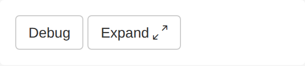</a>

<a href="../images/core_case_evaluation_manual/64_debug_matches_modal.png" title="Open full-size image">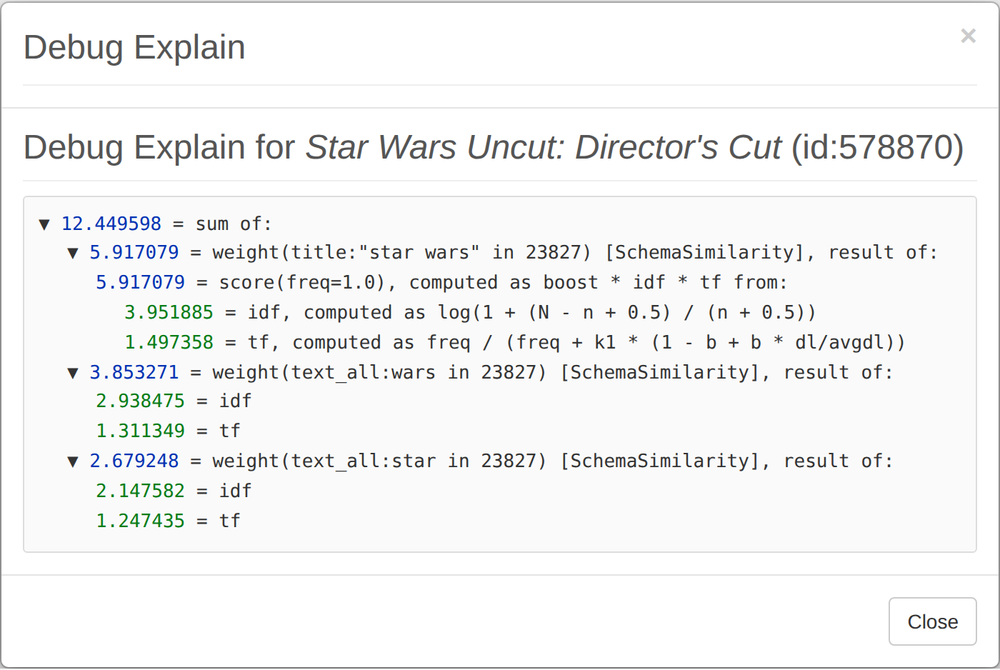</a>

<a href="../images/core_case_evaluation_manual/65_expand_content_modal.png" title="Open full-size image">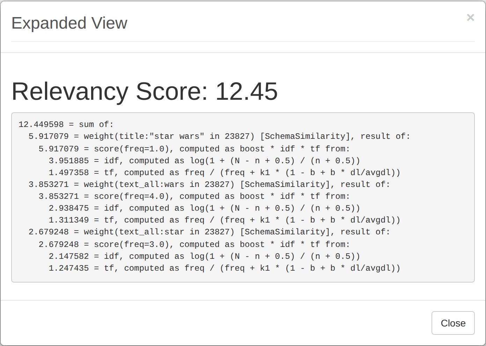</a>

**Media-type fields** can render embedded audio, video, or images via `[quepid-embed]`.

<a href="../images/core_case_evaluation_manual/78_media_embed.png" title="Open full-size image">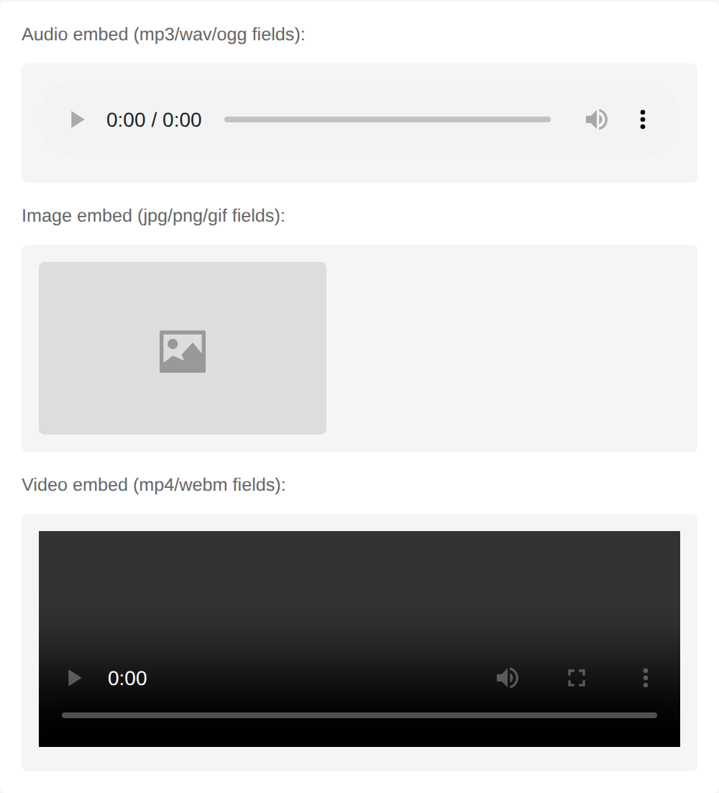</a>

A **threshold** visualization may appear when the UI highlights whether a document is above or below a scorer threshold.

<a href="../images/core_case_evaluation_manual/76_threshold_indicator.png" title="Open full-size image">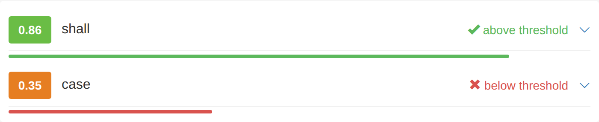</a>

---

## Ratings and Scoring

<a href="../images/core_case_evaluation_manual/06_rating_popover.png" title="Open full-size image">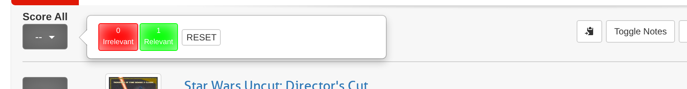</a>

- **Ratings** are per (query, document): you assign a relevance value (and optionally a label) from the scorer’s scale.
- **Query score** – The scorer computes a single score for each query from its ratings (e.g. AP@10, NDCG@10).
- **Case score** – Typically the average (or similar aggregate) of all query scores; shown in the case header.
- **Scorer** – Chosen in “Select scorer” and can be a built‑in (e.g. AP@10) or a custom scorer. The scale (e.g. 0–3) and labels are defined by the scorer.
- Scores update when:
  - You change ratings and the UI recalculates (and may persist scores).
  - You **Rerun My Searches** (or run in background), so results (and thus which docs are in the top N) may change and scores are recomputed.

The **Score All** control on a query sets a default rating for that query; individual result rows override with their own rating. The **rating popover** on each result is the main way to set per‑doc ratings.

---

## Tune Relevance (East Pane)

**Tune Relevance** toggles the east panel. The panel has **tabs**:

<a href="../images/core_case_evaluation_manual/07_east_pane_query_tab.png" title="Open full-size image">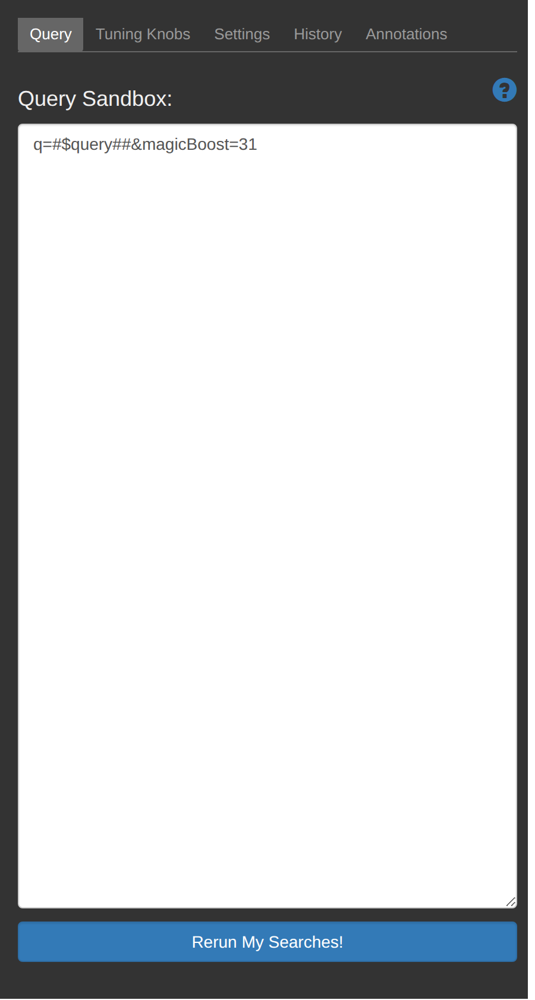</a>

### Query (Query Sandbox)

- **Query parameters** for the current try:
  - **Solr** – Text area for query params (e.g. `q`, `fq`, `defType`).
  - **Elasticsearch / OpenSearch / Vectara / Algolia / SearchAPI** – JSON editor (e.g. query DSL).
- Used to define how each query text is sent to the endpoint (e.g. which field to search, boosts).
- Validation warnings may appear if the template is invalid or inconsistent with the engine.

For **Elasticsearch, OpenSearch, Vectara, Algolia, and SearchAPI**, the sandbox uses the **ACE** JSON editor (`ui-ace`), which may look different from the Solr plain textarea.

<a href="../images/core_case_evaluation_manual/54_ace_query_editor.png" title="Open full-size image">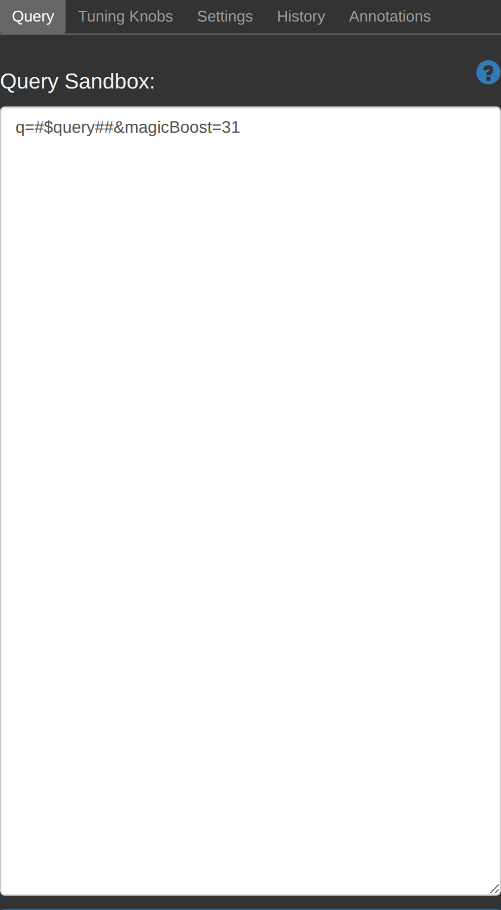</a>

### Tuning Knobs (Curator Variables)

<a href="../images/core_case_evaluation_manual/08_east_pane_tuning_knobs.png" title="Open full-size image">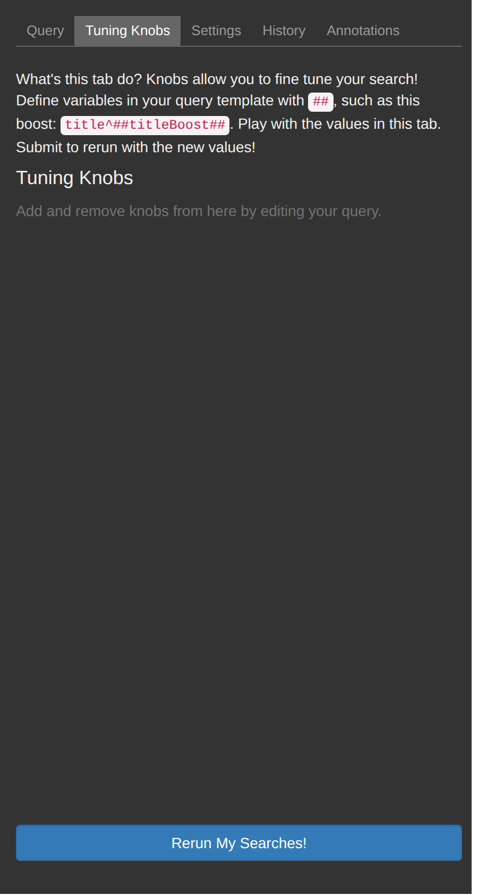</a>

- Variables you define in the query template with `##name##` (e.g. `title^##titleBoost##`).
- Each variable appears as a knob: you can change the value and then **Rerun My Searches** to see the effect.
- Add/remove knobs by editing the query template in the Query tab.

### Settings

<a href="../images/core_case_evaluation_manual/09_east_pane_settings.png" title="Open full-size image">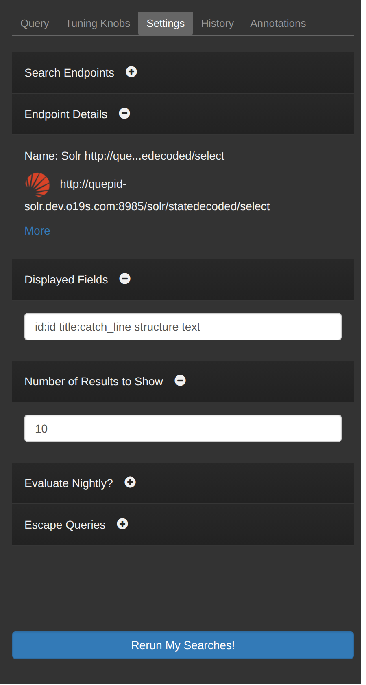</a>

- **Search Endpoints** – Choose which shared endpoint this try uses (dropdown or typeahead). You can link to “More” to edit the endpoint (e.g. URL, API key, custom HTTP headers).
- **Endpoint details** – Name, engine icon, URL, link to edit; TLS/protocol warning if Quepid and the endpoint use different HTTP/HTTPS. A warning appears if the selected endpoint has been **archived** (you can still use it; consider switching to an active endpoint).
- **Displayed fields** – Comma‑separated list of fields to show in result snippets (e.g. `title,description`). Must match what your query/engine returns.
- **Number of results** – How many results to request per query (e.g. 10; max 100).
- **Evaluate Nightly** – Checkbox to mark the case for nightly evaluation. **Rerun My Searches Now in the Background!** queues a background job to run all queries and store results/scores (then you can leave; progress is tracked via the job system).
- **Escape Queries** – (Advanced) Whether to escape special characters in query text. Turn off if you use engine-specific syntax (e.g. `title:value`).

**Custom HTTP headers** for a search endpoint are edited in a dedicated **Custom headers** control (Angular `<custom-headers>` directive). In the current templates it appears in the **case creation wizard**; capture it here for parity with Tune Relevance **Settings** (endpoint configuration) behavior.

<a href="../images/core_case_evaluation_manual/53_custom_headers_editor.png" title="Open full-size image">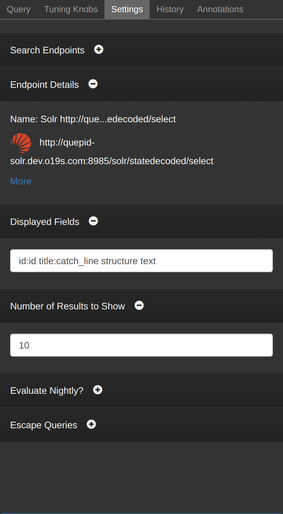</a>

**Displayed fields** may use a richer picker in some configurations (e.g. tag-style field tokens).

The **Evaluate Nightly** and **Escape Queries** sections include tooltips and layout detail that are easy to conflate in a single wide Settings shot; a dedicated capture highlights them.

<a href="../images/core_case_evaluation_manual/56_settings_nightly_escape.png" title="Open full-size image">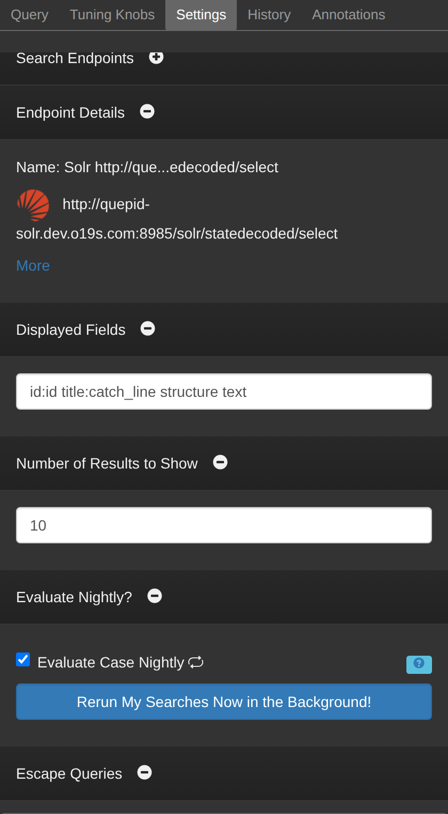</a>

### History

<a href="../images/core_case_evaluation_manual/10_east_pane_history.png" title="Open full-size image">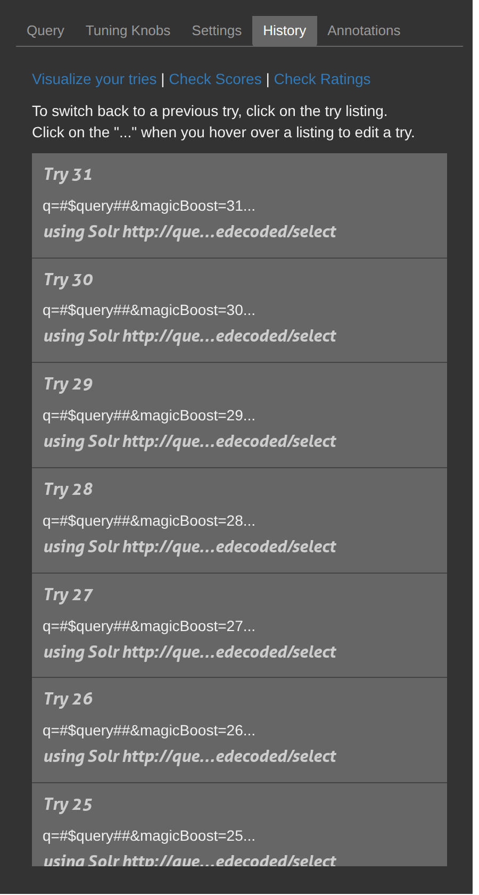</a>

- List of **tries** (past configurations). **Click a try** to switch the view to that try (URL and data load for that try).
- Links such as “Visualize your tries,” “Check Scores,” “Check Ratings” for analytics and data views.
- **“...” on a try** opens try details: **rename**, **delete try**, or **duplicate (clone) try**. You cannot delete the currently active try; switch to another try first.

<a href="../images/core_case_evaluation_manual/31_try_details.png" title="Open full-size image">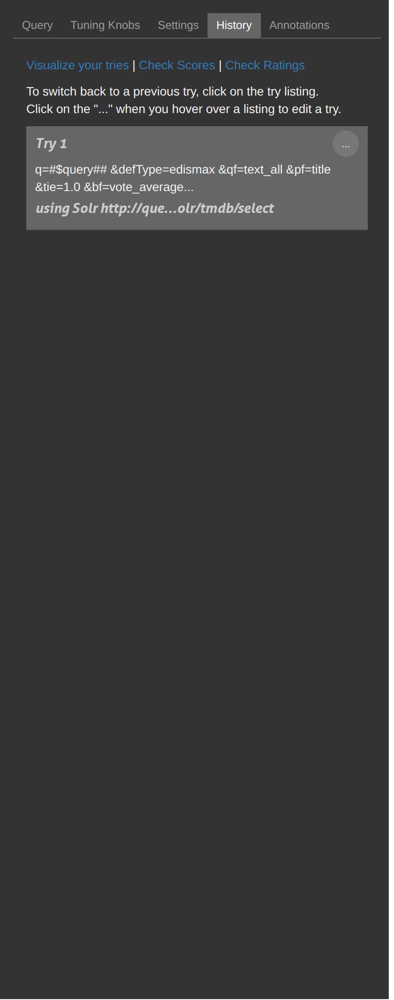</a>

The **Search Endpoints** control supports a **typeahead** in addition to the plain dropdown; the popup lists matching shared endpoints with engine icons.

<a href="../images/core_case_evaluation_manual/77_search_endpoint_typeahead.png" title="Open full-size image">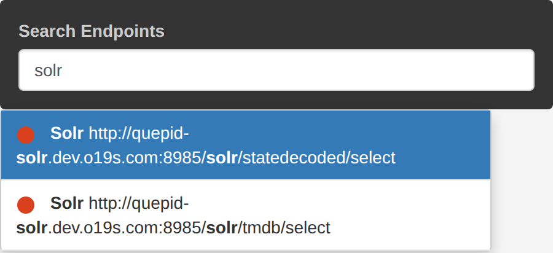</a>

**Visualize your tries** opens an analytics view (Vega tree/cluster) for how tries relate over time.

<a href="../images/core_case_evaluation_manual/68_vega_visualization.png" title="Open full-size image">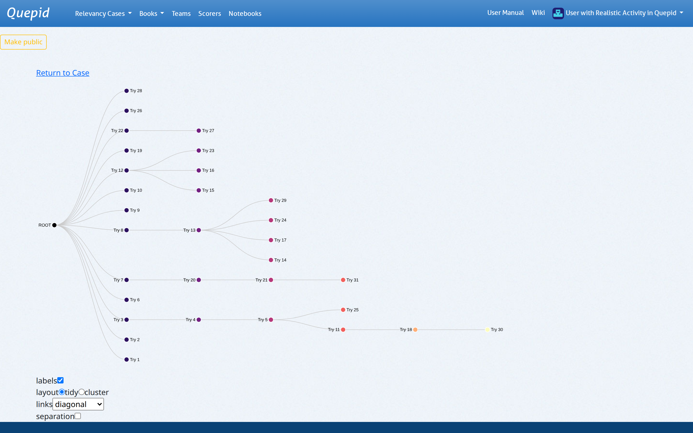</a>

### Annotations

<a href="../images/core_case_evaluation_manual/11_east_pane_annotations.png" title="Open full-size image">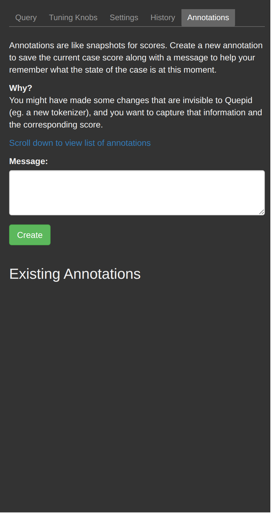</a>

- **Annotations** for the case: notes attached to scores over time (e.g. “Tuned title boost,” “Added new queries”). In this tab you can **add a new annotation** (attached to the current/last score), view the list of annotations, and edit or delete existing ones. You must have **run searches at least once** for the case before you can add an annotation (a score must exist). Used to record why scores changed.

<a href="../images/core_case_evaluation_manual/61_annotation_list_with_items.png" title="Open full-size image">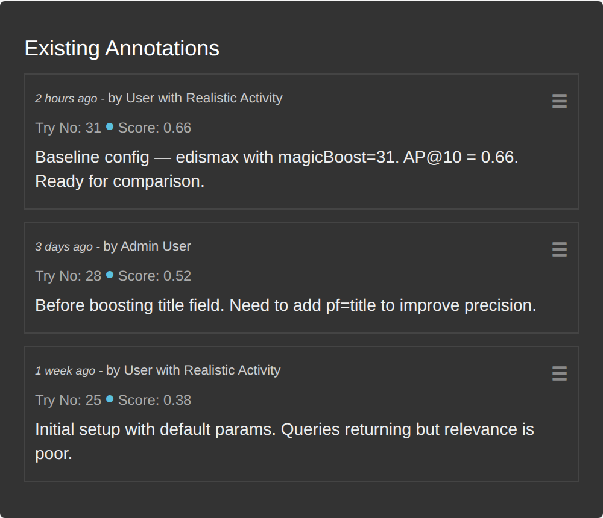</a>

<a href="../images/core_case_evaluation_manual/61b_annotation_update_modal.png" title="Open full-size image">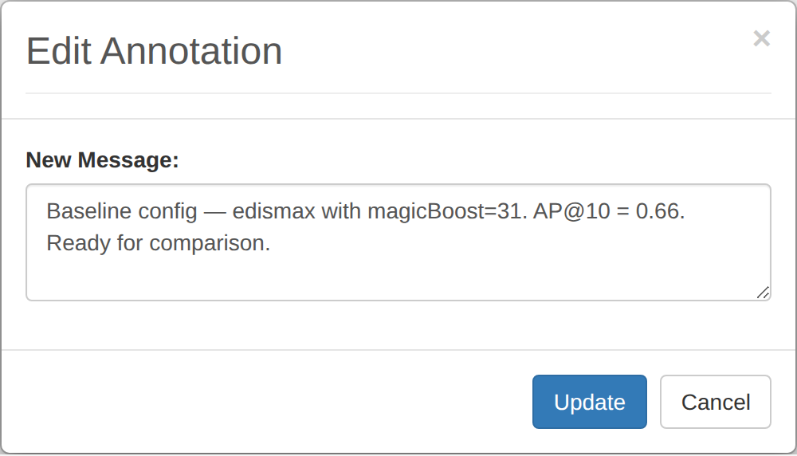</a>

### Rerun Actions (Bottom of Panel)

- **Rerun My Searches!** – Saves the current form values as a **new try** (creates a new try record), navigates to that try, then runs **all** queries in the case in the **foreground** and updates results and scores. This is the main way to “apply” changes after editing query params or knobs; each click builds your try history. For ES/OS/Vectara/Algolia/SearchAPI, the query template is validated as JSON before save; invalid JSON shows an error and does not save.
- **Rerun My Searches Now in the Background!** – Queues a **background job** to run all queries and store results/scores (useful for large cases or when you want to leave the page). Available in the Evaluate Nightly section; on success the UI **redirects to the app root** (e.g. dashboard); progress is visible via the Job Manager if you have access.
- If there is a **protocol mismatch** (e.g. Quepid on HTTPS, endpoint on HTTP), a button may appear to **Reload Quepid in [protocol]** or to fix the endpoint (e.g. use a proxied connection).

---

## Snapshots

<a href="../images/core_case_evaluation_manual/12_snapshot_modal.png" title="Open full-size image">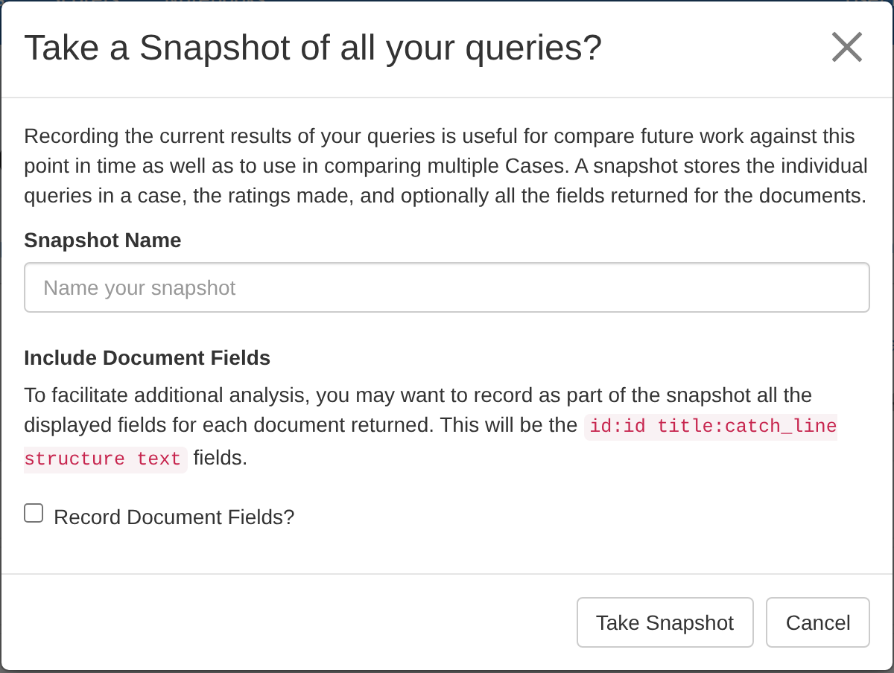</a>

- **Create snapshot** – Saves the current result set (and associated state) for the case under a **name** and timestamp. The modal includes **Record document fields?** (stored as “Include Document Fields” in the template): when checked, snapshot data includes document fields needed for richer comparison. If the endpoint does not support lookup-by-id, the UI may require recording document fields automatically.
- **Compare snapshots** – Opens **Compare Your Search Results** (`diff` component) to select up to **three** snapshots against current results. The live Angular modal uses **dropdowns**, **Add Snapshot**, and actions such as **Update Comparison Settings**, **Clear Comparison View**, and **Cancel** (`app/assets/javascripts/components/diff/_modal.html`).

<a href="../images/core_case_evaluation_manual/60_compare_snapshots_modal.png" title="Open full-size image">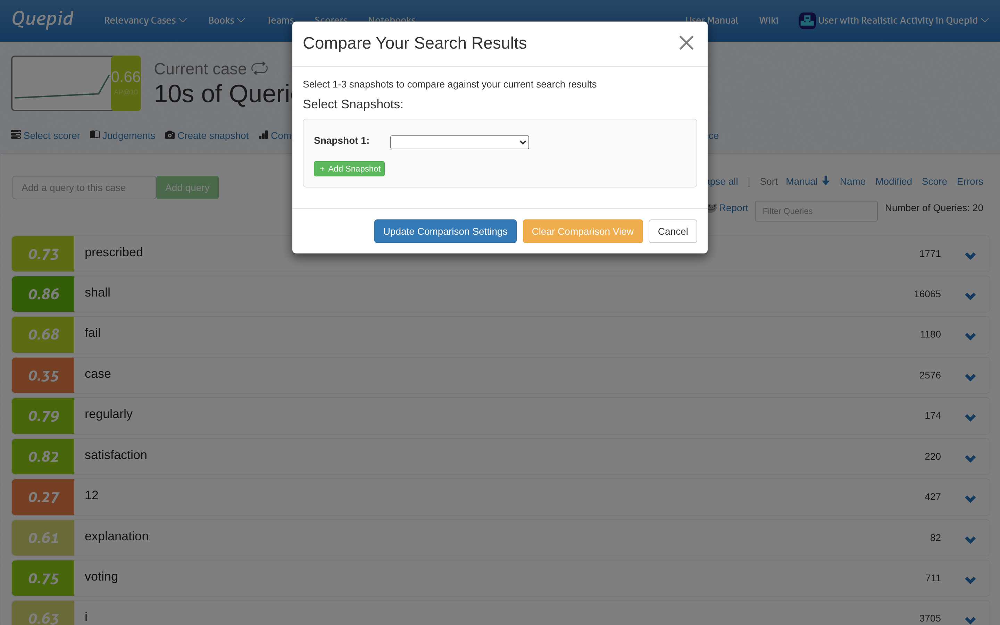</a>

An older capture with **checkbox-style** snapshot selection is retained as **`13_diff_modal.png`** for reference; prefer **`60_compare_snapshots_modal.png`** when updating screenshots to match the current UI.

<a href="../images/core_case_evaluation_manual/13_diff_modal.png" title="Open full-size image">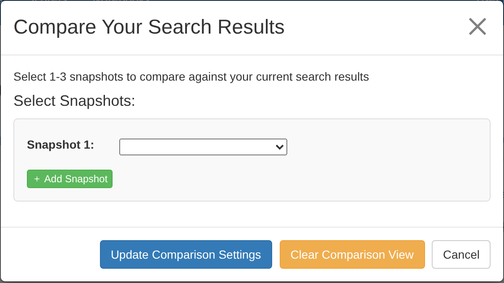</a>

After you select snapshots and confirm:

  - The UI fetches snapshot data and compares it to **current** results (per query and at case level).
  - You see scores (and side‑by‑side result lists when diff view is active) for each snapshot vs current.

<a href="../images/core_case_evaluation_manual/74_diff_scores_header.png" title="Open full-size image">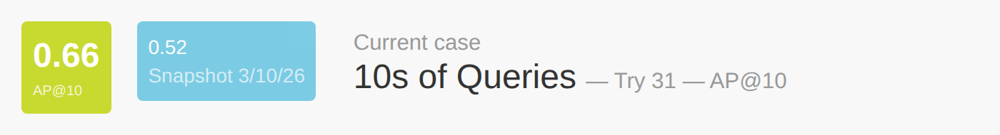</a>

<a href="../images/core_case_evaluation_manual/66_query_diff_results.png" title="Open full-size image">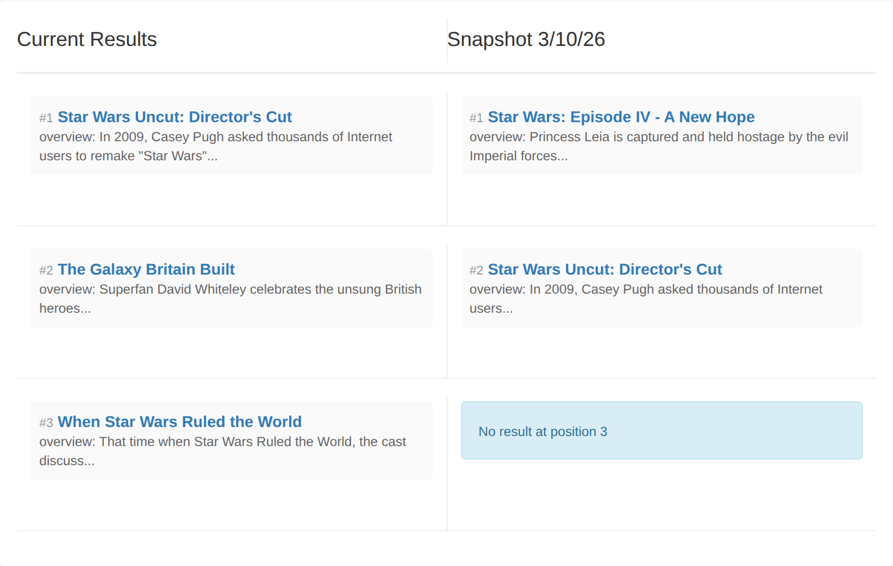</a>

- To stop comparing, use **Clear Comparison View** in the modal or cancel the selection. The view returns to “current results only.”

This lets you compare “before vs after” or “try A vs try B” without losing the current try.

---

## Angular implementation reference

For a **line-by-line map** of Angular templates, directives, components, controllers, and services to screenshot IDs (SS-01–SS-80), see [angularjs_ui_inventory.md](./angularjs_ui_inventory.md). Primary templates for this screen:

| Area | Template |
|------|----------|
| Case actions + query list host | [`app/assets/templates/views/queriesLayout.html`](../../app/assets/templates/views/queriesLayout.html) |
| Query list | [`app/assets/templates/views/queries.html`](../../app/assets/templates/views/queries.html) |
| Expanded query / results block | [`app/assets/templates/views/searchResults.html`](../../app/assets/templates/views/searchResults.html) |
| Single search result row | [`app/assets/templates/views/searchResult.html`](../../app/assets/templates/views/searchResult.html) |
| Tune Relevance (east pane) | [`app/assets/templates/views/devQueryParams.html`](../../app/assets/templates/views/devQueryParams.html) |
| Create snapshot modal | [`app/assets/templates/views/snapshotModal.html`](../../app/assets/templates/views/snapshotModal.html) |

**Related screens** (login, signup, cases list, admin pages, wizard steps, etc.) use additional images in the same `docs/images/core_case_evaluation_manual/` directory; they are catalogued under [angularjs_ui_inventory.md](./angularjs_ui_inventory.md) and are outside the core case workspace narrative above.

---

## Workflow Summary

1. **Open a case** (and try) from the header or cases list.
2. **Confirm or set the scorer** (Select scorer) and **search endpoint** (Tune Relevance → Settings).
3. **Add or adjust queries** (Add query; edit notes/info need if needed on builds that expose those fields).
4. **Run searches** – Use **Run All** and/or per-query **Re-run** on the migrated shell, or rely on your build’s auto-run behavior on the legacy UI.
5. **Rate results** – Expand a query, use the rating popover on each result (or **Score All** for a default on the legacy expanded row).
6. **Tune** – In Tune Relevance, edit Query sandbox and/or Tuning knobs, then click **Rerun My Searches!** to refresh results and scores.
7. **Iterate** – Change ratings or settings, rerun, and watch case/query scores. Use **Create snapshot** and **Compare snapshots** to compare configurations.
8. **Export/Share** – Use **Export**, **Share case**, or **Clone** as needed.

---

## Tips and Notes

- **Protocol:** If the endpoint uses a different protocol (HTTP/HTTPS) than Quepid, the UI may block requests or show a warning. Use a proxied endpoint or run Quepid and the endpoint on the same protocol.
- **Manual sort:** If “Manual” sort is disabled by configuration, you cannot drag‑and‑drop to reorder queries; the legacy Angular list shows a warning icon next to **Manual** with a hover popover (see [angularjs_inventory.md](./angularjs_inventory.md) and [angularjs_elimination_plan.md](./angularjs_elimination_plan.md) for the config flag and migration status).
- **Scores:** Case and query scores depend on the **current** scorer and **current** ratings; after rerun, result order may change and scores are recomputed from the same ratings applied to the new result set.
- **Background run:** “Rerun My Searches Now in the Background!” redirects to the root URL after queuing the job; use the Job Manager (admin) to monitor progress.
- **Static search endpoint:** If the case’s try uses a “Static” search endpoint (pre-loaded dataset), the Query sandbox and Tuning Knobs tabs indicate there are no query settings or knobs to adjust; live search tuning is not applicable.
- **Stalled progress:** If the “Updating Queries: X / Y” counter stalls during a run, try a hard refresh of the page.

For data model and app structure, see `docs/data_mapping.md` and `docs/app_structure.md`. For AngularJS module inventory (files and removal tracking), see [angularjs_inventory.md](./angularjs_inventory.md). For **UI-to-screenshot mapping** of the Angular workspace, see [angularjs_ui_inventory.md](./angularjs_ui_inventory.md) and the [migration index](./README.md).
